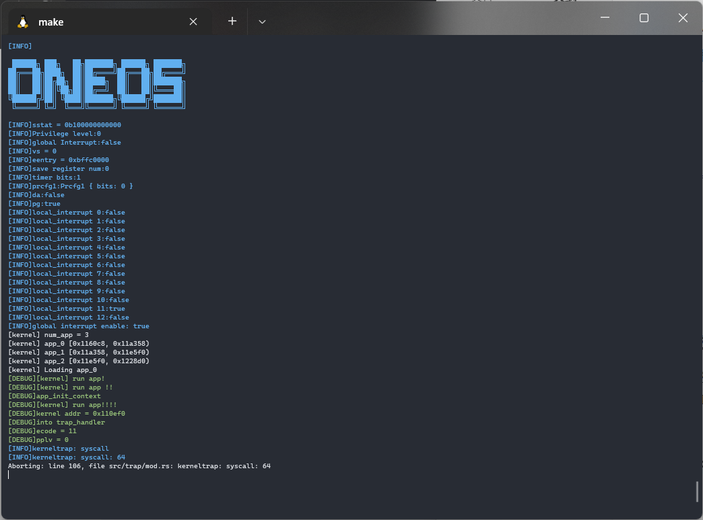

# rCore的龙芯平台移植

#### 项目名称:proj93-la-tsinghuaOS

#### 项目描述:

将清华大学uCore/rCore/zCore教学系统移植到LoongArch平台上，并进行力所能及的优化。清华大学操作系统课程使用的教学系统，uCore为最早的C语言实现版本，rCore为使用rust语言重新实现的版本，支持x86/RISCV/ARM/MIPS等架构，zCore为谷歌微内核zircon的rust实现。

#### 前期调研情况分析

1. loongArch平台上有比较完善的工具链，可以支持rust的开发
2. loongArch的指令和mips、riscv相似，可以快速进行学习
3. 有过rcore的开发经验，项目可以进行
4. 有qemu模拟的龙芯平台可以进行虚拟实验

#### 与导师沟通情况

目前与老师交流了很多问题，都得到了老师耐心的回答，并且老师提供了丰富的资料。当前老师已经建立了微信群。

#### 目标规划:

ch0:

- [x] 阅读LoongArch相关材料，熟悉相关指令和开发流程
- [x] 搭建交叉编译环境,调试linux系统的启动过程
- [x] 将Linux的启动过程的反汇编代码移植进入rCore
- [x] 完成串口输出功能

ch1:

- [ ] qemu模拟的LoongArch平台的关机功能
- [x] LoongArch的操作系统启动过程解析

ch2：

- [x] LoongArch特权指令的使用
- [x] qemu模拟器的地址空间分布
- [ ] buddy system allocator

ch3:

- [x] 中断
- [ ] 计时器

ch4:

- [ ] 页表

........


#### 当前开发状态说明

已经可以成功的运行rcore的前两章代码，但代码中存在BUG会导致运行不成功，目前在调试内核态与用户态之间的对接，修复其中的BUG。



#### 项目运行


```
进入loongrCore目录下
make run
```

#### 一些说明文件和实验过程:

[linker.md](linker.md)

[cross_tool.md](cross_tools.md)

[manual.md](manual.md)

#### 其它仓库地址

https://github.com/Godones/rCoreloongArch


#### 参考资源

* [QEMU模拟器](https://github.com/foxsen/qemu-loongarch-runenv)。可以在PC上模拟运行LoongArch架构的操作系统
* [关于LoongArch架构的工具链及文档](https://github.com/loongson)
* [相关OS信息](https://github.com/chyyuu/os_course_info)

