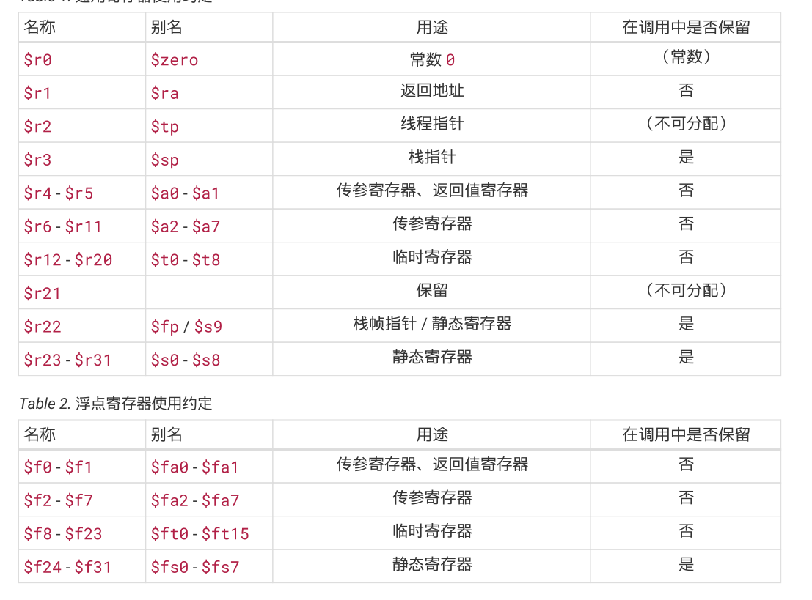
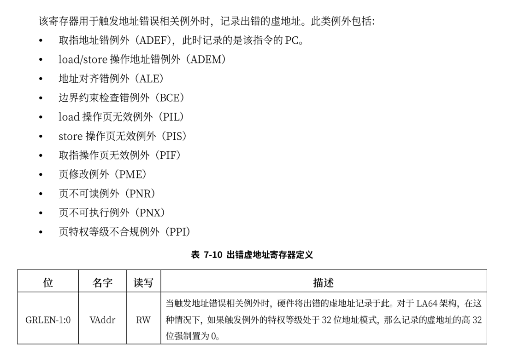
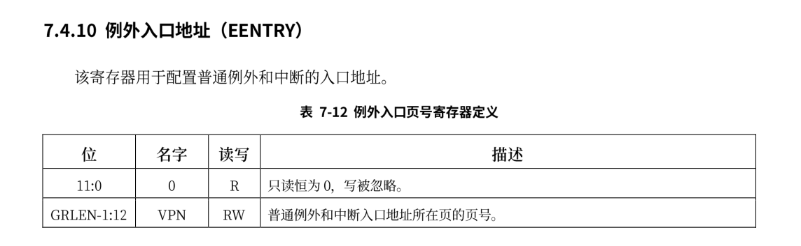
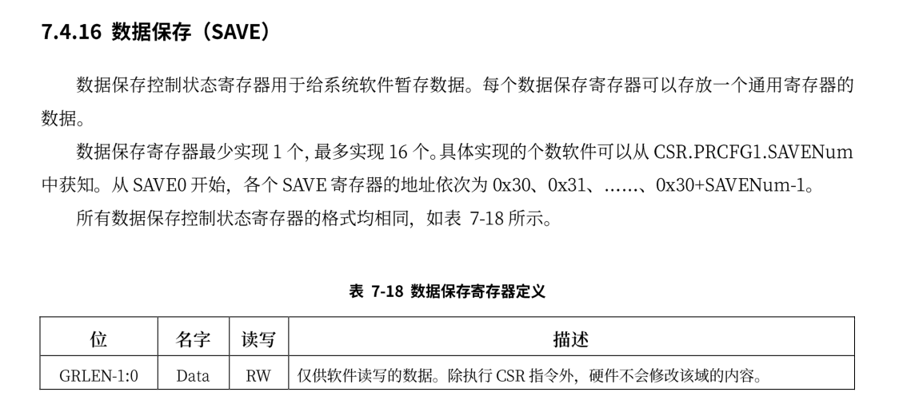
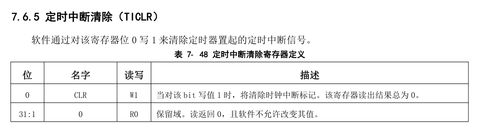

# 应用程序

应用程序的实现与`rCore`中是相同的，差异主要体现在编译和系统调用方式上，与内核编译代码一样，我们也需要使用build.rs在编译前完成替换链接脚本和关闭标准库的工作，并且链接脚本的起始地址也被设置  0x00200000，此阶段内核代码不会超过此范围。

## loongarch寄存器



临时寄存器也被称为调用者保存寄存器。 静态寄存器也被称为被调用者保存寄存器。


## 应用程序二进制接口

ABI定义了应用程序二进制代码中数据结构和函数模块的格式及其访问方式，它使得不同的二进制模块之间的交互成为可能。硬件上并不强制这些内容，因此自成体系的软件可以不遵循部分或者全部 ABI 约定。但通常来说，应用程序至少会依赖操作系统以及系统函数库，因而必须遵循相关约定。

ABI 包括但不限于如下内容：

- 处理器基础数据类型的大小、布局和对齐要求等
-  寄存器使用约定。它约定通用寄存器的使用方法、别名等
-  函数调用约定。它约定参数如何传递给被调用的函数、结果如何返回、函数栈帧如何组织等
-  目标文件和可执行文件格式
-  程序装载和动态链接相关信息
-  系统调用和标准库接口定义
-  开发环境和执行环境等相关约定


loongArch 的函数调用规范包括了整型调用规范，浮点调用规范，而整型或浮点又会包含复合类型，在实验中，进行系统调用时我们传递都是整数，没有更复杂的类型，因此只需要关注整数部分。

基本整型调用规范提供了 8 个参数寄存器 $a0‑$a7 用于参数传递，前两个参数寄存器 $a0$和$a1$也用于返回值。若一个标量宽度至多 XLEN 位（对于 LP32 ABI，XLEN=32，对于 LPX32/LP64，XLEN=64），则它在单个参数寄存器中传递，若没有可用的寄存器，则在栈上传递。若一个标量宽度超过 XLEN 位，不超过 2\*XLEN 位，则可以在一对参数寄存器中传递，低 XLEN 位在小编号寄存器中，高 XLEN 位在大编号寄存器中；若没有可用的参数寄存器，则在栈上传递标量；若只有一个寄存器可用，则低 XLEN位在寄存器中传递，高 XLEN 位在栈上传递。若一个标量宽度大于 2*LEN 位，则通过引用传递，并在参数列表中用地址替换。用栈传递的标量会对齐到类型对齐 (Type Alignment) 和 XLEN 中的较大者，但不会超过栈对齐要求。当整型参数传入寄存器或栈时，小于 XLEN 位的整型标量根据其类型的符号扩展至 32 位，然后符号扩展为 XLEN 位。以上的说明规定了loongArch体系结构下传递整数类型的方式，当前我们的系统工作在64位模式下，并且传递的参数不会超过8个，因此可以直接使用8个寄存器传递参数。


系统调用的汇编代码实现如下:

```assembly
    .section .text
    .globl do_syscall
    .align 4
do_syscall:
    #syscall(id: usize, args0: usize,args1:usize,args2:usize,)
    move $t0,$a0
    move $t1,$a1
    move $t2,$a2
    move $t3,$a3
    move $a7, $t0
    move $a0, $t1
    move $a1, $t2
    move $a2, $t3
    syscall 0
    jr $ra
```

至于为什么使用汇编文件编写而不是像`rCore`中一样使用内联汇编，原因在debug文档下有说明。这里不再赘述。在将各个参数放入寄存器后使用`syscall`指令来进行系统调用，这会触发一个系统调用异常，从而进入内核态。


## 特权级切换

通常异常和中断的处理对用户程序来说是透明的，相关软硬件需要保证处理前后原来执行中的代码看到的 CPU 状态保持一致。这意味着开始异常和中断处理程序之前需要保存所有可能被破坏的、原上下文可见的 CPU状态，并在处理完返回原执行流之前恢复。需要保存的上下文包括异常处理代码的执行可能改变的寄存器.发生异常的地址、处理器状态寄存器、中断屏蔽位等现场信息以及特定异常的相关信息（如触发存储访问异常的地址）。异常和中断的处理代码通常在内核态执行，如果它们触发前处理器处于用户态，硬件会自动切换到内核态。这种情况下通常栈指针也会被重新设置为指向内核态代码所使用的栈，
以便隔离不同特权等级代码的运行信息。

在本节中，当 CPU 在用户态特权级（ loongarch的PLV3模式）运行应用程序，执行到 Trap，切换到内核态特权级（ loongarch的PLV0模式），批处理操作系统的对应代码响应 Trap，并执行系统调用服务，处理完毕后，从内核态返回到用户态应用程序继续执行后续指令。

除了上篇文章提到的几个寄存器外，还需要使用到的寄存器包括:

### BADV



### EENTRY



### SAVE



### TICLR



上面的EENTRY是除了TLB重填例外和机器错误的入口地址，TLB 重填例外的入口来自于CSR.TLBRENTRY。机器错误例外的入口来自于 CSR.MERRENTRY。例外的入口地址采用“入口页号 | 页内偏移”的计算方式。这里“|”是按位或运算，所有普通例外入口的入口页号相同，自于 CSR.EENTRY，入口的偏移由中断偏移的模式和例外号（ecode）共同决定，其值等于
$$
2^{CSR.ECFG.VS+2} \times (code+64)
$$
当 CSR.ECFG.VS=0 时，所有普通例外的入口相同，此时需要软件通过 CSR.ESTAT 中的 Ecode、IS 域的
信息来判断具体的例外类型。当 CSR.ECFG.VS !=0 时，不同的中断源具有不同的例外入口，软件无需通过
访问 CSR.ESTAT 来确认例外类型。由于例外入口是基址“按位或”上偏移值，当 CSR.ECFG.VS !=0 时，软件在分配例外入口基址时需要确保所有可能的偏移值都不会超出入口基址低位所对应的边界对齐空间。在本实验中统一采用同一个入口地址。

当异常发生时，主要会经历下面的阶段:

1. 异常处理准备,当异常发生时，CPU 在转而执行异常处理前，硬件需要进行一系列准备工作。首先，需要记录被异常打断的指令的地址（记为 EPTR）,TLB 重填异常发生时，这一信息将被记录在CSR.TLBRBERA 中; 机器错误异常发生时，这一信息将被记录在 CSR.MERRERA 中,普通异常在CSR.ERA中。其次，调整 CPU 的权限等级（通常调整至最高特权等级）并关闭中断响应。在 LoongArch 指令
   系统中，当异常发生时，硬件会将 CSR.PLV 置 0 以进入最高特权等级，并将 CSR.CRMD 的 IE 域置 0 以屏蔽所有中断输入。再次，硬件保存异常发生现场的部分信息。在 LoongArch指令系统中，异常发生时会将 CSR.CRMD中的 PLV 和 IE 域的旧值分别记录到 CSR.PRMD 的 PPLV 和 PIE 域中，供后续异常返回时使用。最后，记录异常的相关信息。异常处理程序将利用这些信息完成或加速异常的处理。最常见的如记录异常编号以用于确定异常来源。在 LoongArch 指令系统中，这一信息将被记录在 CSR.ESTAT的 Ecode 和 EsubCode 域，前者存放异常的一级编号，后者存放异常的二级编号。除此以外，有些情况下还会将引发异常的指令的机器码记录在 CSR.BADI 中，或是将造成异常的访存虚地址记录在CSR.BADV 中。

2. 确定异常来源。不同类型的异常需要各自对应的异常处理。两种处理方式在介绍EENTRY已经说明。
3. 保存执行状态。在操作系统进行异常处理前，软件要先保存被打断的程序状态，通常至少需要将通用寄存器和程序状态字寄存器的值保存到栈中。也就是下文的trap上下文
4. 处理异常。跳转到对应异常处理程序进行异常处理。也就是下文的trap_handler函数
5. 恢复执行状态并返回。在异常处理返回前，软件需要先将前面第 3 个步骤中保存的执行状态从栈中恢复出来，在最后执行异常返回指令。之所以要采用专用的异常返回指令，是因为该指令需要原子地完成恢复权限等级、恢复中断使能状态、跳转至异常返回目标等多个操作。在 LoongArch中，异常返回的指令是 ERTN，该指令会将 CSR.PRMD 的 PPLV 和 PIE 域分别回填至 CSR.CRMD 的 PLV 和IE 域，从而使得 CPU 的权限等级和全局中断响应状态恢复到异常发生时的状态，同时该指令还会将 CSR.ERA 中的值作为目标地址跳转过去。

### Trap上下文

`rCore`中关于Trap上下文的定义如下:

```rust
#[repr(C)]
#[derive(Debug, Copy, Clone)]
pub struct TrapContext {
    pub x: [usize; 32], //通用寄存器 ，第4个寄存器是sp
    pub sstatus: usize, //控制状态寄存器
    pub sepc: usize,    //异常处理返回地址
}
```

本实验中未做特殊的修改，但是其中sstatus保存的是PRMD的值，而sepc保存的是era的值。trap上下文的保存和恢复如下：

```assembly
    .section k_eentry
    .globl __alltraps
    .globl __restore
    .align 4
__alltraps:
    # csrrw sp, sscratch, sp
    #需要交换 sp 与 0x502 寄存器的值
    csrwr $sp, 0x502

    addi.d  $sp, $sp, -272
    #保存通用寄存器
    st.d $r0, $sp, 0
    st.d $r1, $sp, 8
    st.d $r2, $sp, 16
    # 这里不需要保存 sp的值
    #st.d $r3, $sp, 24 #sp
    st.d $r4, $sp, 32
    st.d $r5, $sp, 40
    st.d $r6, $sp, 48
    st.d $r7, $sp, 56
    st.d $r8, $sp, 64
    st.d $r9, $sp, 72
    st.d $r10, $sp, 80
    st.d $r11, $sp, 88
    st.d $r12, $sp, 96
    st.d $r13, $sp, 104
    st.d $r14, $sp, 112
    st.d $r15, $sp, 120
    st.d $r16, $sp, 128
    st.d $r17, $sp, 136
    st.d $r18, $sp, 144
    st.d $r19, $sp, 152
    st.d $r20, $sp,160
    #st.d $r21, $sp, 168
    st.d $r22, $sp, 176
    st.d $r23, $sp, 184
    st.d $r24, $sp, 192
    st.d $r25, $sp, 200
    st.d $r26, $sp, 208
    st.d $r27, $sp, 216
    st.d $r28, $sp, 224
    st.d $r29, $sp, 232
    st.d $r30, $sp, 240
    st.d $r31, $sp, 248

    #读取crmd
    csrrd $t0, 0x1
    csrrd $t1, 0x6 #返回地址
    st.d $t0, $sp,256
    st.d $t1, $sp,264

    csrrd $t2,0x502 #读出用户栈指针

    st.d $t2, $sp,24
    # set input argument of trap_handler(cx: &mut TrapContext)

    move $a0, $sp
    bl trap_handler

__restore:
    move $sp, $a0
    ld.d $t1, $sp,264
    ld.d $t0, $sp,256 #PRMD
    ld.d $t2, $sp,24  #用户栈指针

    csrwr $t1, 0x6    #返回地址
    csrwr $t2, 0x502  #将用户栈指针放到DSAVE中
    csrwr $t0, 0x1    #恢复CRMD的值

    # 恢复通用寄存器
    ld.d $r0, $sp, 0
    ld.d $r1, $sp, 8
    ld.d $r2, $sp, 16
    # 这里不需要恢复 sp,此时这个内存位置是用户栈指针
    # ld.d $r3, $sp, 24
    ld.d $r4, $sp, 32
    ld.d $r5, $sp, 40
    ld.d $r6, $sp, 48
    ld.d $r7, $sp, 56
    ld.d $r8, $sp, 64
    ld.d $r9, $sp, 72
    ld.d $r10, $sp, 80
    ld.d $r11, $sp, 88
    ld.d $r12, $sp, 96
    ld.d $r13, $sp, 104
    ld.d $r14, $sp, 112
    ld.d $r15, $sp, 120
    ld.d $r16, $sp, 128
    ld.d $r17, $sp, 136
    ld.d $r18, $sp, 144
    ld.d $r19, $sp, 152
    ld.d $r20, $sp,160
    ld.d $r21, $sp, 168
    ld.d $r22, $sp, 176
    ld.d $r23, $sp, 184
    ld.d $r24, $sp, 192
    ld.d $r25, $sp, 200
    ld.d $r26, $sp, 208
    ld.d $r27, $sp, 216
    ld.d $r28, $sp, 224
    ld.d $r29, $sp, 232
    ld.d $r30, $sp, 240
    ld.d $r31, $sp, 248
    #r0不用恢复
    # release TrapContext on kernel stack
    addi.d $sp, $sp, 272

    csrwr $sp, 0x502
    #将用户栈指针与内核栈指针交换
    ertn
```

整体上来说与`rCore`中的类似，但这里使用的sscratch 寄存器被替换为DSAVE寄存器（0x502），这是一个调试数据保存寄存器，由于在qemu中检查到没有实现上述提到SAVE寄存器，因此只能暂时使用此寄存器。

相对而言，初始化例外入口比`rCore`中要复杂，具体实现如下：

```rust
pub fn init() {
    extern "C" {
        fn __alltraps();
    }
    let mut ticlr = Ticlr::read();
    ticlr.clear();
    Ecfg::read().set_vs(0);
    Ecfg::read().set_local_interrupt(11,false);
    Crmd::read().set_interrupt_enable(false); //关闭全局中断   
    Eentry::read().set_eentry(__alltraps as usize); // 设置中断入口
}
```

首先通过TICLR寄存器写入来消除时钟中断，再设置ECFG.vs = 0,使得所有例外的入口地址指向同一个，然后修改ECFG的中断配置，将已经开启的时钟中断关闭，修改CRMD关闭全局中断，这阶段不需要开启中断。最后设置中断入口。由于中断入口需要4k对齐，因此在链接脚本中需要将其设置对齐。

trap_handle的实现如下:

```rust
#[no_mangle]
pub fn trap_handler(cx: &mut TrapContext) -> &mut TrapContext {
    let prmd = Prmd::read().get_val(); //记录例外前的信息
    let estat = Estat::read();
    if (prmd & PRMD_PPLV) != 0 {
        // 非特权级0的例外
        // INFO!("kerneltrap: not from privilege0");
    }
    let crmd = Crmd::read();
    if crmd.get_interrupt_enable() {
        // 全局中断会在中断处理程序被关掉
        INFO!("kerneltrap: global interrupt enable");
    }
    match estat.cause() {
        Trap::Syscall => {
            //系统调用
            cx.sepc += 4;
            cx.x[4] = syscall(cx.x[11], [cx.x[4], cx.x[5], cx.x[6]]) as usize;
        }
        Trap::LoadPageFault | Trap::StorePageFault | Trap::FetchPageFault => {
            //页面异常
            println!("[kernel] PageFault in application, core dumped.");
            run_next_app();
        }
        Trap::InstructionNotExist => {
            //指令不存在
            println!("[kernel] IllegalInstruction in application, core dumped.");
            run_next_app();
        }
        Trap::InstructionPrivilegeIllegal => {
            //指令权限不足
            println!("[kernel] InstructionPrivilegeIllegal in application, core dumped.");
            run_next_app();
        }
        _ => {
            let mut record = 0;
            for i in 0..13{
                if estat.get_val().get_bit(i){
                    record = i;
                }
            }
            panic!(
                "Unsupported trap {:?}, interrupt = {}!",
                estat.get_val().get_bits(16..=21),record
            );
        }
    }
    cx
}
```

trap_handler的处理主要是读取estat,得到发生异常的原因进行相关处理。

为了进入用户态，需要在任务的trap上下文中保存PRMD的值，通过将其PPLV域设置为用户态，在trap上下文恢复完成后使用ertn指令即可将PPLV的值恢复到CRMD.PLV中，此时处理器就运行在用户态下了。
