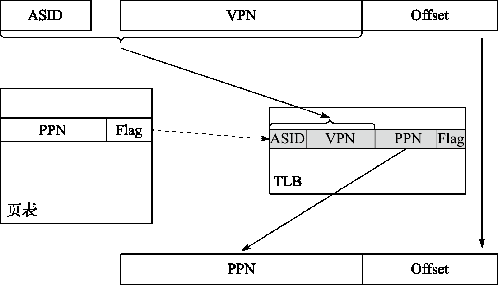
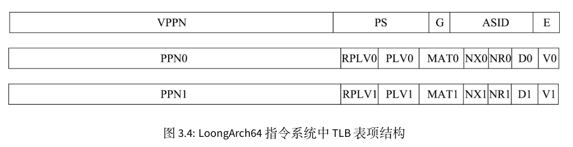
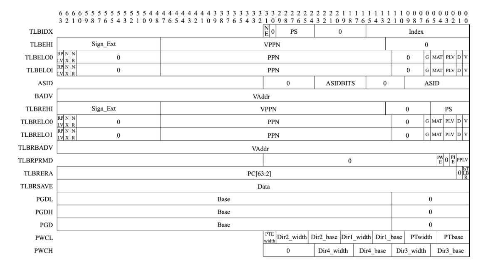
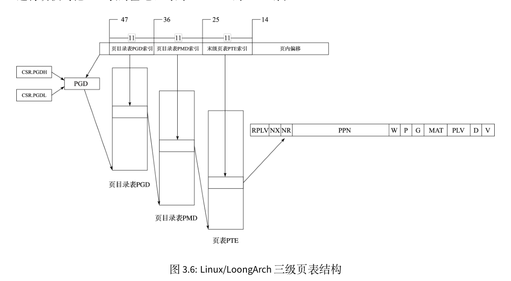
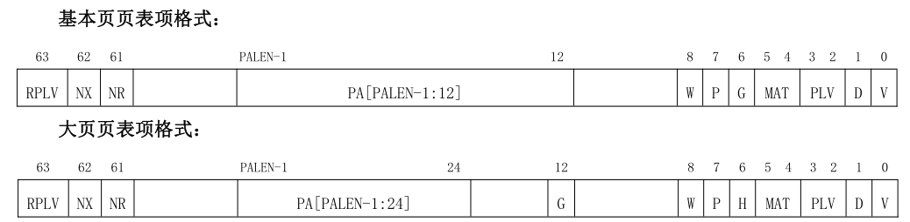
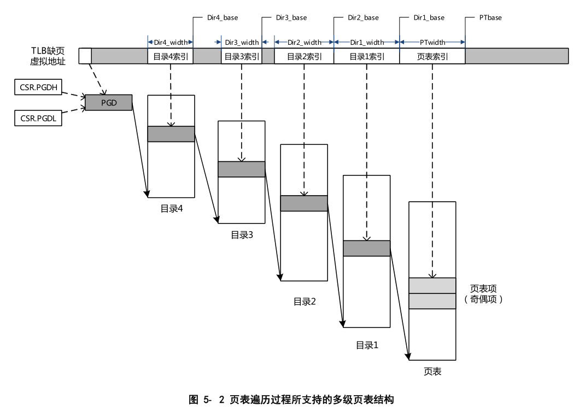

# 多级页表硬件机制

处理器的存储管理部件（Memory Management Unit，简称 MMU）支持虚实地址转换、多进程空间等功能，是通用处理器体现 “通用性” 的重要单元，也是处理器和操作系统交互最紧密的部分。存储管理构建虚拟的内存地址，并通过 MMU 进行虚拟地址到物理地址的转换。存储管理的作用和意义包括以下方面。

- 隐藏和保护：用户态程序只能访问受限内存区域的数据，其他区域只能由核心态程序访问。引入存储管理后，不同程序仿佛在使用独立的内存区域，互相之间不会影响。此外，分页的存储管理方法对每个页都有单独的写保护，核心态的操作系统可防止用户程序随意修改自己的代码段
- 为程序分配连续的内存空间：MMU 可以由分散的物理页构建连续的虚拟内存空间，以页为单元管理物理内存分配
- 扩展地址空间：在 32 位系统中，如果仅采用线性映射的虚实地址映射方式，则至多访问4GB 物理内存空间，而通过 MMU 进行转换则可以访问更大的物理内存空间
- 节约物理内存：程序可以通过合理的映射来节约物理内存。当操作系统中有相同程序的多个副本在同时运行时，让这些副本使用相同的程序代码和只读数据是很直观的空间优化措施，而通过存储管理可以轻松完成这些。此外，在运行大型程序时，操作系统无须将该程序所需的所有内存都分配好，而是在确实需要使用特定页时再通过存储管理的相关异常处理来进行分配，这种方法不但节约了物理内存，还能提高程序初次加载的速度。

为了提高页表访问的速度，现代处理器中通常包含一个转换后援缓冲器（TranslationLookaside Buffer，简称 TLB）来实现快速的虚实地址转换。TLB 也称页表缓存或快表，借由局部性原理，存储当前处理器中最经常访问页的页表。一般 TLB 访问与 Cache 访问同时进行，而 TLB 也可以被视为页表的 Cache。TLB 中存储的内容包括虚拟地址、物理地址和保护位，可分别对应于 Cache 的Tag、Data 和状态位。

包含 TLB 的地址转换过程如下图所示:

	

处理器用地址空间标识符（Address Space Identifier，简称 ASID）和虚拟页号（Virtual Page Number，
简称 VPN）在 TLB 中进行查找匹配，若命中则读出其中的物理页号（Physical Page Number，简称 PPN）
和标志位（Flag）。标志位用于判断该访问是否合法，一般包括是否可读、是否可写、是否可执行等，
若非法则发出非法访问异常；物理页号用于和页内偏移（Offset）拼接组成物理地址。若未在 TLB
中命中，则需要将页表内容从内存中取出并填入 TLB 中，这一过程通常称为 TLB 重填（TLB Refill）。
TLB 重填可由硬件或软件进行，例如 X86、ARM 处理器采用硬件 TLB 重填，即由硬件完成页表遍历
（Page Table Walker），将所需的页表项填入 TLB 中；而 MIPS、LoongArch 处理器默认采用软件 TLB 重填，即查找 TLB 发现不命中时，将触发 TLB 重填异常，由异常处理程序进行页表遍历并进行 TLB 填入。

页表映射模式存储管理的核心部件是 TLB。LoongArch 指令系统下 TLB 分为两个部分，一个是所有表项的页大小相同的单一页大小 TLB（Singular‑Page‑Size TLB，简称 STLB），另一个是支持不同表项的页大小可以不同的多重页大小 TLB（Multiple‑Page‑Size TLB，简称 MTLB）。STLB 的页大小可通过STLBPS 控制寄存器进行配置。

在虚实地址转换过程中，STLB 和 MTLB 同时查找。相应地，软件需保证不会出现 MTLB 和 STLB同时命中的情况，否则处理器行为将不可知。MTLB 采用全相联查找表的组织形式，STLB 采用多路组相联的组织形式。对于 STLB，如果其有 2^INDEX 组，且配置的页大小为 2^PS 字节，那么硬件查询 STLB的过程中，是将虚地址的PS+index:PS位作为索引来访问各路信息

## TLB表项

STLB 和 MTLB 的表项格式基本一致，区别仅在于 MTLB 每个表项均包含页大小信息，而 STLB 因为是同一
页大小所以 TLB 表项中不再需要重复存放页大小信息。

- 存在位(E)，1 比特。为 1 表示所在 TLB 表项非空，可以参与查找匹配。
- 地址空间标识(ASID)，10 比特。地址空间标识用于区分不同进程中的同样的虚地址，避免进程切换时清空整个 TLB 所带来的性能损失。操作系统为每个进程分配唯一的 ASID，TLB 在进行查找时除了比对地址信息一致外，还需要比对 ASID 信息
- 全局标志位(G)，1 比特。当该位为 1 时，查找时不进行 ASID 是否一致性的检查。当操作系统需要在所有进程间共享同一虚拟地址时，可以设置 TLB 页表项中的 G 位置为 1。
- 页大小(PS)，6 比特。仅在 MTLB 中出现。用于指定该页表项中存放的页大小。数值是页大小的 2的幂指数。即对于 16KB 大小的页，PS=14
- 虚双页号(VPPN)，(VALEN-PS-1)比特。在龙芯架构中，每一个页表项存放了相邻的一对奇偶相邻页表信息，所以 TLB 页表项中存放虚页号的是系统中虚页号/2 的内容，即虚页号的最低位不需要存放在 TLB 中。查找 TLB 时在根据被查找虚页号的最低位决定是选择奇数号页还是偶数号页的物理转换信息
- 有效位(V)，1 比特。为 1 表明该页表项是有效的且被访问过的
- 脏位(D)，1 比特。为 1 表示该页表项项所对应的地址范围内已有脏数据。
- 不可读位(NR)，1 比特。为 1 表示该页表项所在地址空间上不允许执行 load 操作。该控制位仅定义在 LA64 架构下。
- 不可执行位(NX)，1 比特。为 1 表示该页表项所在地址空间上不允许执行取指操作。该控制位仅定义在 LA64 架构下
- 存储访问类型(MAT)，2 比特。控制落在该页表项所在地址空间上访存操作的存储访问类型
- 特权等级（PLV），2 比特。该页表项对应的特权等级。当 RPLV=0 时，该页表项可以被任何特权等级不低于 PLV 的程序访问；当 RPLV=1 时，该页表项仅可以被特权等级等于 PLV 的程序访问
- 受限特权等级使能（RPLV），1 比特。页表项是否仅被对应特权等级的程序访问的控制位。请参看上面 PLV 中的内容。该控制位仅定义在 LA64 架构下
- 物理页号(PPN)，(PALEN-12)比特。当页大小大于 4KB 的时候，TLB 中所存放的 PPN 的[PS-1:12]位可以是任意值

用 TLB 进行虚实地址翻译时，首先要进行 TLB 查找，将待查虚地址 vaddr 和 CSR.ASID 中 ASID 域的值 asid 一起与 STLB 中每一路的指定索引位置项以及 MTLB 中的所有项逐项进行比对。如果 TLB 表项的 E 位为 1，且 vaddr 对应的虚双页号 vppn 与 TLB 表项的 VPPN 相等（该比较需要根据 TLB 表项对应的页大小，只比较地址中属于虚页号的部分），且 TLB 表项中的 G 位为 1 或者 asid 与 TLB 表项的ASID 域的值相等，那么 TLB 查找命中该 TLB 表项。如果没有命中项，则触发 TLB 重填异常（TLBR）。

如果查找到一个命中项，那么根据命中项的页大小和待查虚地址确定 vaddr 具体落在双页中的哪一页，从奇偶两个页表项取出对应页表项作为命中页表项。如果命中页表项的 V 等于 0，说明该页表项无效，将触发页无效异常，具体将根据访问类型触发对应的 load 操作页无效异常（PIL）、store操作页无效异常（PIS）或取指操作页无效异常（PIF）。

如果命中页表项的 V 值等于 1，但是访问的权限等级不合规，将触发页权限等级不合规异常（PPI）。权限等级不合规体现为，该命中页表项的 RPLV 值等于 0 且 CSR.CRMD 中 PLV 域的值大于命中页表项中的 PLV 值，或是该命中页表项的 RPLV=1且 CSR.CRMD 中 PLV 域的值不等于命中页表项中的 PLV 值。

如果上述检查都合规，还要进一步根据访问类型进行检查。如果是一个 load 操作，但是命中页表项中的 NR 值等于 1, 将触发页不可读异常（PNR）；如果是一个 store 操作，但是命中页表项中的 D 值等于 0, 将触发页修改异常（PME）；如果是一个取指操作，但是命中页表项中的 NX 值等于 1, 将触发页不可执行异常（PNX）。

如果找到了命中项且经检查上述异常都没有触发，那么命中项中的 PPN 值和 MAT 值将被取出，前者用于和 vaddr中提取的页内偏移拼合成物理地址 paddr，后者用于控制该访问操作的内存访问类型属性。

LoongArch 指令系统中用于访问和控制 TLB 的控制状态寄存器大致可以分为三类：第一类用于非 TLB 重填异常处理场景下的 TLB 访问和控制，包括 TLBIDX、TLBEHI、TLBELO0、TLBELO1、ASID 和BADV；第二类用于 TLB 重填异常处理场景，包括此场景下 TLB 访问控制专用的 TLBREHI、TLBRELO0、TLBRELO1 和 TLBRBADV 以及此场景下保存上下文专用的 TLBRPRMD、TLBRERA 和 TLBRSAVE；第三类用于控制页表遍历过程，包括 PGDL、PGDH、PGD、PWCL 和 PWCH.

上述寄存器中，第二类专用于 TLB 重填异常处理场景（CSR.TLBRERA 的 IsTLBR 域值等于 1）的控制寄存器，其设计目的是确保在非 TLB 重填异常处理程序执行过程中嵌套发生 TLB 重填异常处理。后，原有异常处理程序的上下文不被破坏。例如，当发生 TLB 重填异常时，其异常处理返回地址将填入 CSR.TLBRERA 而非 CSR.ERA，这样被嵌套的异常处理程序返回时所用的返回目标就不会被破坏。因硬件上只维护了这一套保存上下文专用的寄存器，所以需要确保在 TLB 重填异常处理过程中不再触发 TLB 重填异常，为此，处理器因 TLB 重填异常触发而陷入异常处理后，硬件会自动将虚实地址翻译模式调整为直接地址翻译模式，从而确保 TLB 重填异常处理程序第一条指令的取指和访存6一定不会触发 TLB 重填异常，与此同时，软件设计人员也要保证后续 TLB 重填异常处理返回前的所有指令的执行不会触发 TLB 重填异常。

当触发 TLB 重填异常时，除了更新 CSR.CRMD 外，CSR.CRMD 中 PLV、IE 域的旧值将被记录到CSR.TLBRPRMD 的相关域中，异常返回地址也将被记录到 CSR.TLBRERA 的 PC 域中，处理器还会将引发该异常的访存虚地址填入 CSR.TLBRBAV 的 VAddr 域并从该虚地址中提取虚双页号填入 CSR.TLBREHI的 VPPN 域。当触发非 TLB 重填异常的其他 TLB 类异常时，除了像普通异常发生时一样更新 CRMD、PRMD 和 ERA 这些控制状态寄存器的相关域外，处理器还会将引发该异常的访存虚地址填入CSR.BADV 的 VAddr 域并从该虚地址中提取虚双页号填入 CSR.TLBEHI 的 VPPN 域。

为了对 TLB 进行维护，除了上面提到的 TLB 相关控制状态寄存器外，LoongArch 指令系统中还定义了一系列 TLB 访问和控制指令，主要包括 TLBRD、TLBWR、TLBFILL、TLBSRCH 和 INVTLB。

TLBSRCH为 TLB查找指令，其使用 CSR.ASID中 ASID域和 CSR.TLBEHI中 VPPN域的信息（当处于 TLB重填异常处理场景时，这些值来自 CSR.ASID 和 CSR.TLBREHI）去查询 TLB。如果有命中项，那么将命中项的索引值写入 CSR.TLBIDX 的 Index 域，同时将其 NE 位置为 0；如果没有命中项，那么将该寄存器的 NE 位置 1。

TLBRD 是读 TLB 的指令，其用 CSR.TLBIDX 中 Index 域的值作为索引读出指定 TLB 表项中的值并将其写入 CSR.TLBEHI、CSR.TLBELO0、CSR.TLBELO1 以及 CSR.TLBIDX 的对应域中。

TLBWR 是写 TLB 的指令，其用 CSR.TLBIDX 中 Index 域的值作为索引将 CSR.TLBEHI、CSR.TLBELO0、
CSR.TLBELO1以及 CSR.TLBIDX相关域的值（当处于 TLB重填异常处理场景时，这些值来自 CSR.TLBREHI、
CSR.TLBRELO0 和 CSR.TLBRELO1）写到对应的 TLB 表项中。

在实验中，上述三个指令用于TLB页修改异常的处理中。

TLBFILL 是填入 TLB 的指令，其将 CSR.TLBEHI、CSR.TLBELO0、CSR.TLBELO1 以及 CSR.TLBIDX 相关域
的值（当处于 TLB 重填异常处理场景时，这些值来自 CSR.TLBREHI、CSR.TLBRELO0 和 CSR.TLBRELO1）填
入 TLB 中的一个随机位置。该位置的具体确定过程是，首先根据被填入页表项的页大小来决定是写入 STLB 还是 MTLB。当被填入的页表项的页大小与 STLB 所配置的页大小（由 CSR.STLBPS 中 PS 域的值决定）相等时将被填入 STLB，否则将被填入 MTLB。页表项被填入 STLB 的哪一路，或者被填入MTLB 的哪一项，是由硬件随机选择的。	

INVTLB 指令用于无效 TLB 中符合条件的表项，即从通用寄存器 rj 和 rk 得到用于比较的 ASID 和虚地址信息，依照指令 op 立即数指示的无效规则，对 TLB 中的表项逐一进行判定，符合条件的 TLB表项将被无效掉。

## 多级页表结构

loongarch处理器与risc-v处理器不同之处在于risc-v是根据satp寄存器的Mode域决定分页机制，而loongarch上在获取到其虚拟地址位宽后可以设置不同的页大小从而得到不同的多级页表结构，如果其有效虚地址位宽为 48 位，那么当 操作系统采用 16KB 页大小时，其页表为三级结构，如下图所示:

33 位的虚双页号（VPPN）分为三个部分：最高 11 位作为一级页表（页目录表 PGD）索引，一级页表中每
一项保存一个二级页表（页目录表 PMD）的起始地址；中间 11 位作为二级页表索引，二级页表中每一项保存一个三级页表（末级页表 PTE）的起始地址；最低 11 位作为三级页表索引。每个三级页表包含 2048 个页表项，每个页表项管理一个物理页，大小为 8 字节，包括 RPLV、NX、NR、PPN、W、P、G、MAT、PLV、D、V 的信息。“P” 和 “W” 两个域分别代表物理页是否存在，以及该页是否可写。这些信息虽然不填入 TLB 表项中，但用于页表遍历的处理过程。每个进程的 PGD 表基地址放在进程上下文中，内核进程进行切换时把 PGD 表的基地址写到 CSR.PGDH 的 Base 域中，用户进程进行切换时把 PGD 表的基地址写到 CSR.PGDL 的 Base 域中。在实验中我们只会使用PGDL，上述说明用于完善的操作系统中，因为完善的操作系统内核会被放置于内存的高位区域中，应用程序位于低地址区域中，但本实验中内核与应用程序都位于同一段物理内存区间。

页表项的定义总共包含两种，上图是其中一种：

这里我们不关注大页页表项格式。

因此除了三级页表外，如果设置页大小不同，那么得到的多级页表页不相同，但总体而言，多级页表的格式如下:

本实验会采用页大小为16kb的页，使用三级页表完成。
