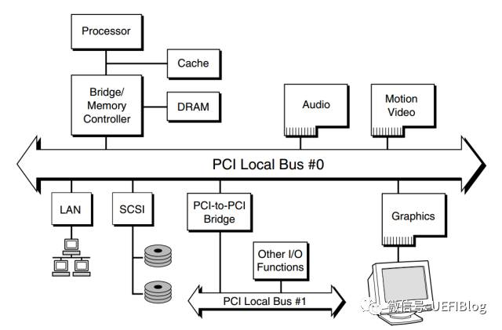

# pci设备探测

在rcore中，为了在内核中接入文件系统，添加了块设备到模拟的机器上，但qemu模拟的loongarch机器上似乎无法使用`virtio-blk-device`设备，因此我们选择使用STATA硬盘模拟，并添加了Ahci协议。在qemu的启动项中需要添加相应的命令

```
@qemu-system-loongarch64 \
    -m 1G \
    -smp 1 \
    -bios $(BOOTLOADER) \
    -kernel $(KERNEL_ELF) \
    -vga none -nographic \
    -drive file=$(FS_IMG),if=none,format=raw,id=x0 \
    -device ahci,id=ahci0 \
    -device ide-hd,drive=x0,bus=ahci0.0
```

PCI总线的全称是Peripheral Component Interconnect，也就是外围设备互联总线，PCI总线是一种共享总线，总线上的设备分时共享这条总线。其简易的示意图如下所示:



对于OS的开发者来说，我们需要做的就是获取PCI总线的设备，并对相应的设备完成正确的配置。

在 PCI 协议下，IO 的系统空间分为三个部分：配置空间、IO 空间和 Memory 空间。配置空间存储设备的基本信息，主要用于设备的探测和发现；IO 空间比较小，用于少量的设备寄存器访问；Memory 空间可映射的区域较大，可以方便地映射设备所需要的大块物理地址空间。由于PCI支持设备即插即用，所以PCI设备不占用固定的内存地址空间或I/O地址空间，而是由操作系统决定其映射的基址。系统加电时，BIOS检测PCI总线，确定所有连接在PCI总线上的设备以及它们的配置要求，并进行系统配置。所以，所有的PCI设备必须实现配置空间，从而能够实现参数的自动配置，实现真正的即插即用。

对于 X86 架构来说，IO 空间的访问需要使用 IO 指令操作，Memory 空间的访问则需要使用通常的 load/store 指令操作。而对于 MIPS 或者 LoongArch 这种把设备和存储空间统一编址的体系结构来说，IO 空间和 Memory 空间没有太大区别，都使用 load/store 指令操作。IO 空间与 Memory 空间的区别仅在于所在的地址段不同，对于某些设备的 Memory 访问，可能可以采用更长的单次访问请求。例如对于 IO 空间，可以限制为仅能使用字访问，而对于 Memory 空间，则可以任意地使用字、双字甚至更长的 Cache 行访问。

PCI总线规范定义的每个设备的配置空间总长度为256个字节，配置信息按一定的顺序和大小依次存放。前64个字节的配置空间称为配置头，对于所有的设备都一样，配置头的主要功能是用来识别设备、定义主机访问PCI卡的方式（I/O访问或者存储器访问，还有中断信息）。其余的192个字节称为本地配置空间（设备有关区），主要定义卡上局部总线的特性、本地空间基地址及范围等。每个设备的配置空间中的地址偏移由总线号、设备号、功能号和寄存器号的组合得到，通过对这个组合的全部枚举，可以很方便地检测到系统中存在的所有设备。

| Bit 31 | Bits 30-24 | Bits 23-16 | Bits 15-11    | Bits 10-8       | Bits 7-0        |
| ------ | ---------- | ---------- | ------------- | --------------- | --------------- |
| addr   | addr       | Bus Number | Device Number | Function Number | Register Offset |

256字节的寄存器分布如下所示:


厂商识别号（Vendor ID）与设备识别号（Device ID）的组合是唯一的，由专门的组织进行管理。每一个提供 PCI 设备的厂商都应该拥有唯一的厂商识别号，以在设备枚举时正确地找到其对应的驱动程序。其中class code 和subclass字段合起来可以识别出这个设备的具体类型，比如说块设备或者是网卡设备。

访问设备配置空间有两种方式，x86下通常会使用I/O端口进行访问，在loongarch下我们使用MMIO方式访问，查看qemu的源代码可以知道配置空间的基地址为0x2000_0000，我们需要将上述地址偏移+基地址才能得到设备配置空间。在配置空间中，并没有设备本身功能上所使用的寄存器。这些寄存器实际上是由可配置的 IO 空间或 	Memory 空间来索引的,配置空间中存在 6 组独立的基址寄存器（Base Address Registers，简称 BAR）。这些 BAR 一方面用于告诉软件该设备所需要的地址空间类型及其大小，另一方面用于接收软件给其配置的基地址。

BAR 的寄存器定义如下图所示，其最低位表示该 BAR 是 IO 空间还是 Memory 空间。BAR 中间有一部分只读位为 0，正是这些 0 的个数表示该 BAR 所映射空间的大小，也就是说 BAR 所映射的空间为 2 的幂次方大小。BAR 的高位是可写位，用来存储软件设置的基地址


对 PCI 设备的探测和驱动加载是一个递归调用过程，大致算法如下:

1. 将初始总线号、初始设备号、初始功能号设为 0
2. 使用当前的总线号、设备号、功能号组成一个配置空间地址，使用该地址，访问其 0 号寄存器，检查其设备号。
3. 如果读出全 1 或全 0，表示无设备。
4. 如果该设备为有效设备，检查每个 BAR 所需的空间大小，并收集相关信息。
5. 检测其是否为一个多功能设备(Header Type )，如果是则将功能号加 1 再重复扫描，执行第 2 步。
6. 如果该设备为桥设备，则给该桥配置一个新的总线号，再使用该总线号，从设备号 0、功能号 0 开始递归调用，执行第 2 步。
7. 如果设备号非 31，则设备号加 1，继续执行第 2 步；如果设备号为 31，且总线号为 0，表示扫描结束，如果总线号非 0，则退回上一层递归调用。


为了完成PCI设备扫描，我们引入了pci库来简化实现，原来的库使用x86结构下的端口进行访问，因此我们需要将部分实现修改为使用MMIO方式访问

```rust
#[derive(Debug, Copy, Clone, PartialEq, Eq)]
pub enum CSpaceAccessMethod {
    MemoryMapped,
}
```

在访问配置空间的定义中，我们删除掉了I/O访问方式

```rust
/// Returns a value in native endian.
pub unsafe fn read32<T: PortOps>(self, _ops: &T, loc: Location, offset: u16) -> u32 {
    debug_assert!(
        (offset & 0b11) == 0,
        "misaligned PCI configuration dword u32 read"
    );
    let addr = loc.encode() + (offset as usize);
    match self {
        CSpaceAccessMethod::MemoryMapped => {
            let addr = addr as *const u32;
            addr.read_volatile()
        }
    }
}
 pub unsafe fn write32<T: PortOps>(self, _ops: &T, loc: Location, offset: u16, val: u32) {
        debug_assert!(
            (offset & 0b11) == 0,
            "misaligned PCI configuration dword u32 read"
        );
        let addr = loc.encode() + (offset as usize);
        match self {
            CSpaceAccessMethod::MemoryMapped => {
                let addr = addr as *mut u32;
                addr.write_volatile(val)
            }
        }
    }
```

在读取寄存器值的部分，直接访问内存而不通过端口。

```rust
#[derive(Debug, Copy, Clone, PartialEq, Eq)]
pub struct Location {
    base_addr: usize, //base address of the device
    pub bus: u8,
    pub device: u8,
    pub function: u8,
}
impl Location {
    #[inline(always)]
    fn encode(self) -> usize {
        self.base_addr
            | ((self.bus as usize) << 16)
            | ((self.device as usize) << 11)
            | ((self.function as usize) << 8)
    }
}

```

在配置空间偏移地址的定义中，也需要根据MMIO方式加入基地址。根据上文给出的构造方式完成偏移地址的构建。

扫描pci的代码如下:

```rust
for dev in unsafe {
        scan_bus(
            &UnusedPort,
            CSpaceAccessMethod::MemoryMapped,
            PCI_CONFIG_ADDRESS,
        )
    } {
        info!(
            "pci: {:02x}:{:02x}.{} {:#x} {:#x} ({} {}) irq: {}:{:?}",
            dev.loc.bus,
            dev.loc.device,
            dev.loc.function,
            dev.id.vendor_id,
            dev.id.device_id,
            dev.id.class,
            dev.id.subclass,
            dev.pic_interrupt_line,
            dev.interrupt_pin
        );
        dev.bars.iter().enumerate().for_each(|(index, bar)| {
            if let Some(BAR::Memory(pa, len, _, t)) = bar {
                info!("\tbar#{} (MMIO) {:#x} [{:#x}] [{:?}]", index, pa, len, t);
            } else if let Some(BAR::IO(pa, len)) = bar {
                info!("\tbar#{} (IO) {:#x} [{:#x}]", index, pa, len);
            }
        });
}
```

设备需要通过中断与CPU通讯，在配置空间中的`interrupt line`提供了设备使用的IRQ,但我们不使用这种方法，而是需要启用MSI中断，loongarch的中断机制在后续会进行介绍。在PCI中，MSI中断是可选功能，因此需要在配置空间的能力链表中查询，能力链表的寄存器如下所示


如果低8为寄存器的值为0x5，说明设备支持MSI中断。在知道设备支持MSI中断后下一步就是去启用MSI中断。这需要通过设置上图中message control寄存器，其定义如下:


第0位控制启用MSI中断，第1-3位设置设备最多使用中断的数量，本实验中默认为1，第4-6位设置设备允许使用 的中断数量，这里也是1。具体的设置在下节中设置STAT设备有介绍。

