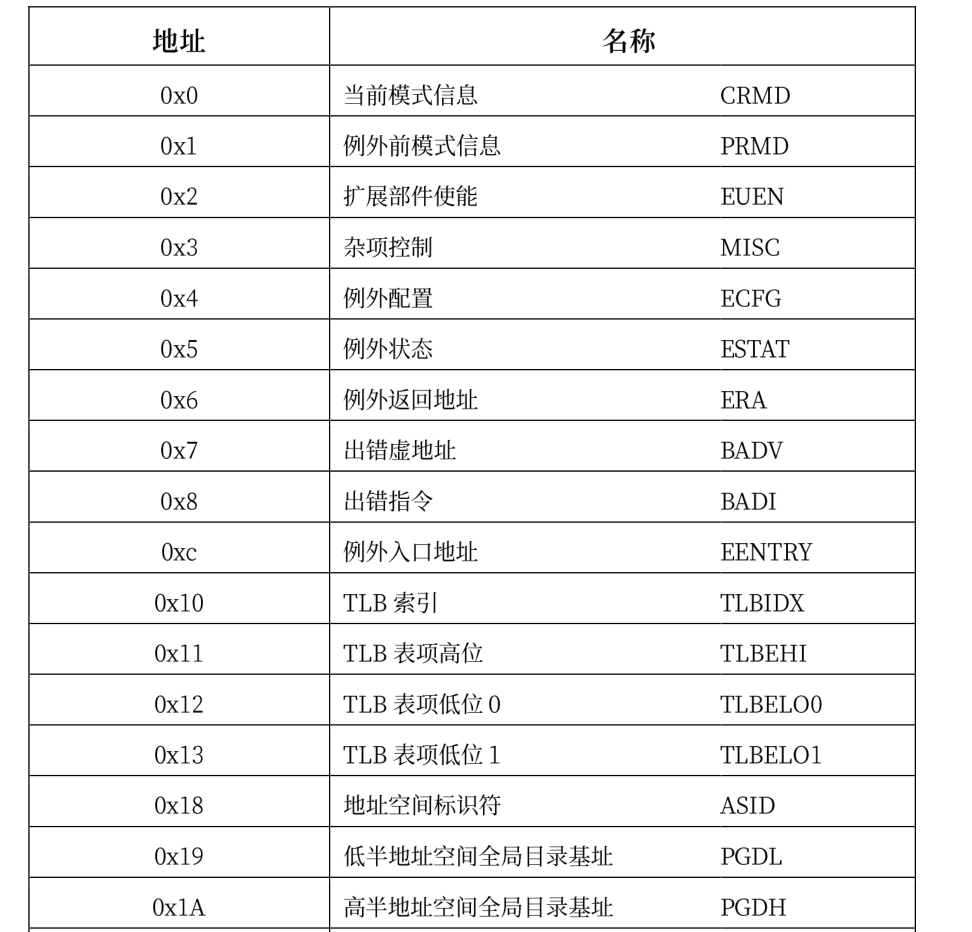
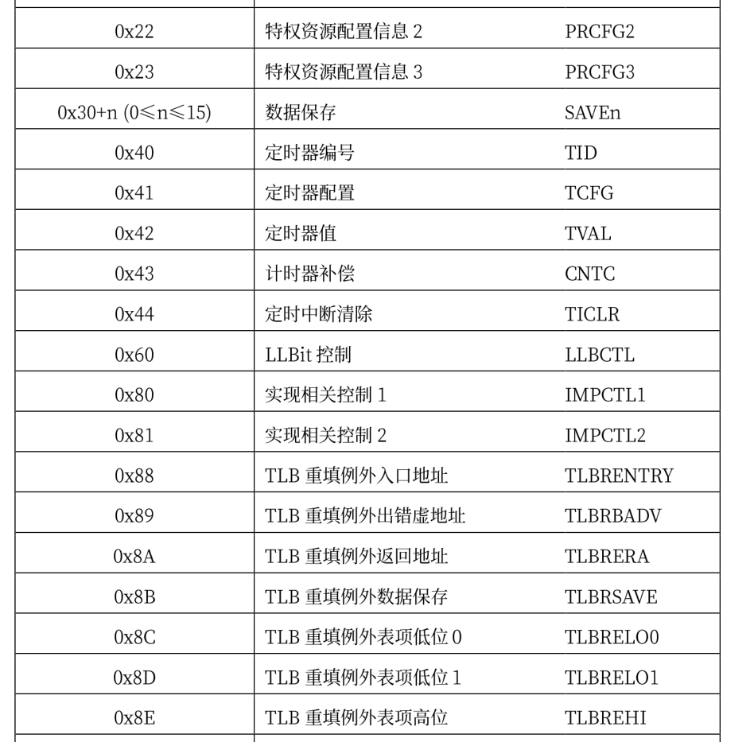
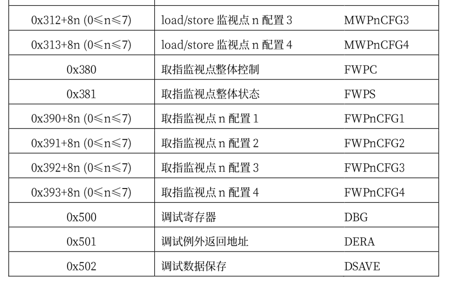
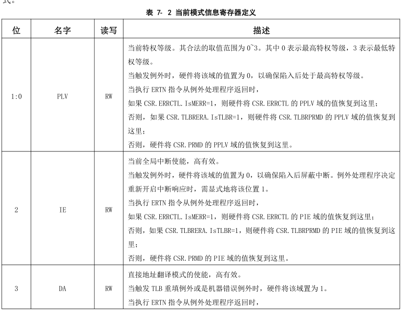
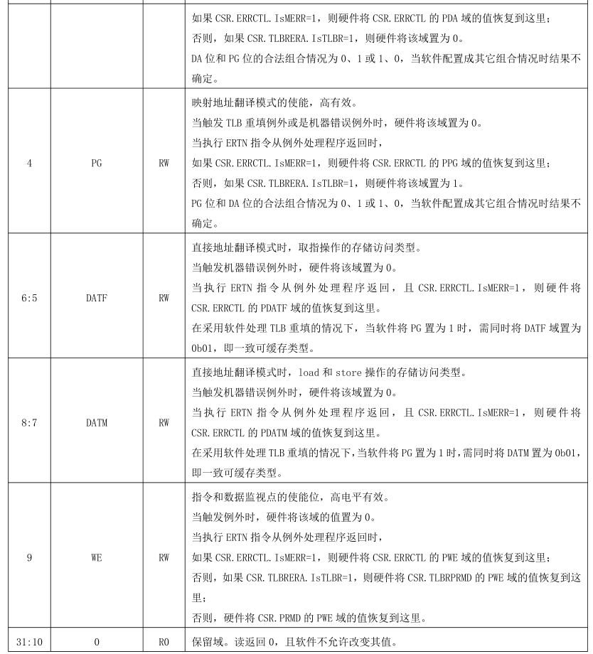
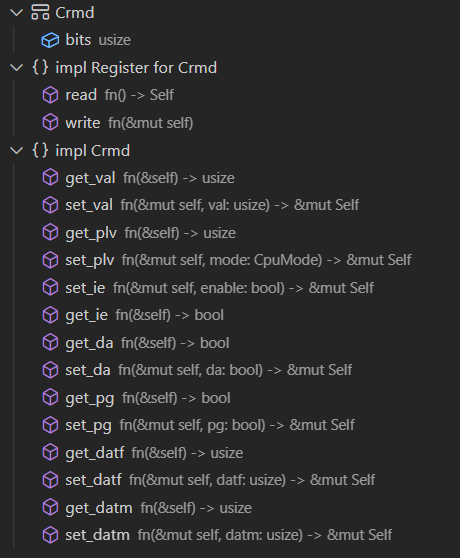
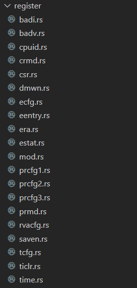
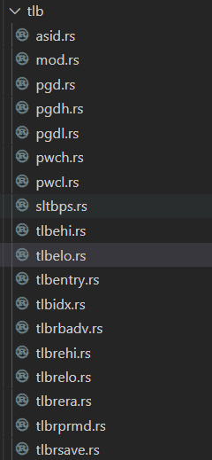
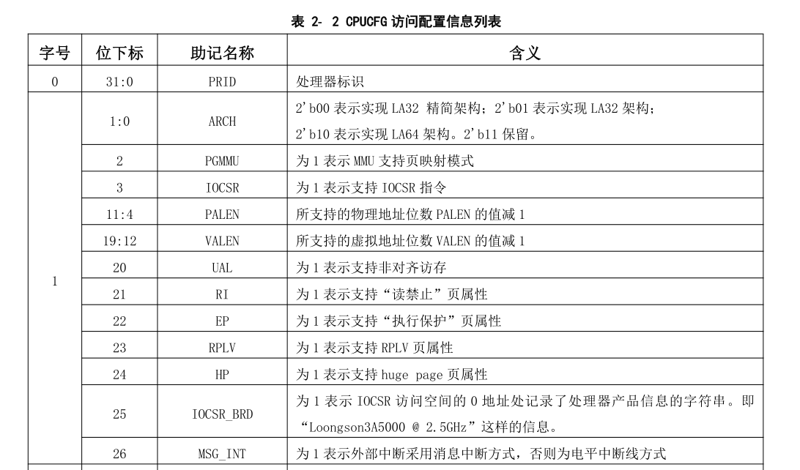

# 寄存器设计

在`risc-v`或者`x86`平台，rust均有对应的库支持，里面包含各种寄存器操作或者IO操作的抽象，而对`loongarch`平台的支持的库少之又少，在前面的实验中虽然对loongarch的部分寄存器也进行了抽象，但使用起来仍然比较不方便，因此在开始这一章的实验前，需要对loongarch平台上的相关寄存器添加支持，类似于建立一个crate，方便后面的代码对寄存器进行操作。

loongarch下的控制状态寄存器包含如下：









这些寄存器各个位上的含义各不相同，并且同一个寄存器各个位的读取属性也不一样，具体的读写属性有四种:

1. RW——软件可读、可写。除在定义中明确指出的会导致处理器执行结果不确定的非法值，软件可
   以写入任意值。通常情况下，软件对这些域进行先写后读的操作，读出的应该是写入的值。但是，
   当所访问的域可以被硬件更新时，或者执行读、写操作的两条指令之间有中断发生，则有可能出
   现读出值与写入值不一致的情况。
2. R——软件只读。软件写这些域不会更新其内容，且不产生其它任何副作用
3. R0——软件读取这些域永远返回 0。但是同时软件必须保证，要么通过设置 CSR 写屏蔽位避免更新
   这些域，要么在更新这些域时必须要写入 0 值。这一要求是为了确保软件向后兼容。对于硬件实
   现来说，标记这种属性的域将禁止软件写入。
4. W1——软件写 1 有效。软件对这些域写 0 不会将其清 0，且不产生其它任何副作用。同时，定义为
   该属性的域的读出值没有任何软件意义，软件应该无视这些读出值。


所有控制状态寄存器的位宽，或者固定为 32 位，或者与所实现的是 LA32 还是 LA64 相关。对于第一种
类别的寄存器，其在 LA64 架构下被 CSR 指令访问时，读返回的是符号扩展至 64 位后的值，写的时候高 32
位的值自动被硬件忽略。对于第二种类型，定义将明确指出 LA32 和 LA64 架构下的差异.当软件使用 CSR 指令访问的 CSR 对象是架构规范中未定义的，或者是架构规范中定义的可实现项但是具体硬件未实现的，此时读动作返回的可以是任意值，但写动作不应改变软件可见的处理器状态。

在前面的章节中我们已经看到了部分寄存器的使用，通常，对所有可用的寄存器都会实现`Register`trait,其定义如下：

```rust
pub trait Register {
    fn read() -> Self;
    fn write(&mut self);
}
```

因此，如果想要写一个寄存器必须将其先读出，虽然这可能带来一定的性能损失，因为可能有人会选择直接设置寄存器的值，但经过思考，大部分控制状态寄存器的值是不会被修改的，只有某些位的值需要我们修改，因此可以在读出其值的情况下再去设置某个位，这样一来就避免了手动查看寄存器各个位的默认值然后再设置整个值带来的复杂性，因此这里选择了这种读出写入的模式。

比如CRMD寄存器各个位的定义如下:





那么针对它的寄存器实现如下:



实现中会针对寄存器的各个有效域和对应的读写属性提供相应的函数，用户在使用时可以直接对想要读写的域进行操作，而且对大多数寄存器而言都会提供`get_val`和`set_val`两个函数，这两个函数通常为直接想要设置寄存器整个值的人使用，在C语言编写的操作系统通常会使用或操作来设置整个寄存器的值。

其它的寄存器与上面的实现是类似的，这里就不再给出各个寄存器的详细实现，可以查看源代码以获取更多详细。实验中实现了图标给出的大部分寄存器，部分未使用到的寄存器也可以按照上述方法较为容易实现。这里给出实验中完成的寄存器:






loonarch定义了一个CPUCFG指令，用于软件在执行过程中动态识别所运行的处理器中实现了龙芯架构中的哪些功能特性。这些指令系统功能特性的实现情况记录在一系列配置信息字中，CPUCFG 指令执行一次可以读取一个配置信息字。

配置信息字中包含一系列配置位（域），其记录形式为 CPUCFG.<配置字号>.<配置信息助记名称>[位下
标]，其中单比特配置位的位下标记为 bitXX，表示配置字的第 XX 位；多比特的配置域的位下标记为 bitXX:YY，表示配置字的第 XX 位到第 YY 位的连续(XX-YY+1)位。例如，1 号配置字中的第 0 位用以表示是否实现 LA32架构，将这个配置信息记录为 CPUCFG.1.LA32[bit0]，其中 1 表示配置信息字的字号是 1 号，LA32 表示这个配置信息域所起的助记名称叫做 LA32，bit0 表示 LA32 这个域位于配置字的第 0 位。1 号配置字中第 11位到第 4 位的记录所支持物理地址位数的 PALEN 域则记为 CPUCFG.1.PALEN[bit11:4]

配置字包含的信息很多，可以查看提供的文档了解各个配置字含义，这里给出第1，2个配置字各位的含义，在本章节中，只实现了几个暂时需要使用的配置字。



对配置字的抽象如下:

```rust
pub struct CPUCFG {
    bits: usize,
}

impl CPUCFG {
    // 读取index对应字的内容
    pub fn read(index: usize) -> Self {
        let mut bits;
        unsafe {
            asm!("cpucfg {},{}",out(reg) bits,in(reg) index);
        }
        Self { bits }
    }
    pub fn get_bit(&self, index: usize) -> bool {
        self.bits.get_bit(index)
    }
    pub fn get_bits(&self, start: usize, end: usize) -> usize {
        self.bits.get_bits(start..=end)
    }
}
```

当我们想获取支持的虚拟地址位数，需要提供的实现如下:

```rust
pub fn get_valen() -> usize {
  let cfg = CPUCFG::read(1);
  cfg.get_bits(12, 19) + 1
}
```

在实验中，在完成中断和异常初始化后会打印当前机器的相关信息，从这个函数中我们可以看到各个寄存器和cpu配置字的使用方法

```rust
// 打印硬件的相关信息
pub fn print_machine_info() {
    info!("PALEN: {}", get_palen()); //支持的物理地址范围
    info!("VALEN: {}", get_valen()); //支持的虚拟地址范围
    info!("Support MMU-Page :{}", get_mmu_support_page());
    info!("Support Read-only :{}", get_support_read_forbid());
    info!(
        "Support Execution-Protect :{}",
        get_support_execution_protection()
    ); //是否支持执行保护页属性
    info!("Support RPLV: {}", get_support_rplv()); //是否支持吃rplv页属性
    info!("Support RVA: {}", get_support_rva()); //是否支持虚拟地址缩减
    info!("Support RVAMAX :{}", get_support_rva_len()); //支持的虚拟地址缩减的长度
    info!("Support Page-Size: {:#b}", Prcfg2::read().get_val()); //支持的页大小,
    match Prcfg3::read().get_tlb_type() {
        0 => {
            info!("No TLB");
        }
        1 => {
            info!("Have MTLB");
        }
        2 => {
            info!("Have STLB + MTLB");
        }
        _ => {
            info!("Unknown TLB");
        }
    }
    info!("MLTB Entry: {}", Prcfg3::read().get_mtlb_entries()); //MTLB的页数量
    info!("SLTB Ways :{}", Prcfg3::read().get_stlb_ways()); //STLB的路数量
    info!("SLTB Entry: {}", Prcfg3::read().get_sltb_sets()); //STLB每一路的项数
    info!("SLTB Page-size: {}", SltbPs::read().get_page_size()); //STLB的页大小
    info!("PTE-size: {}", Pwcl::read().get_pte_width()); //PTE的大小
    info!("TLB-RFill entry_point: {:#x}", TLBREntry::read().get_val()); //TLB重填的入口地址
    info!("TLB-RFill page-size :{}", TlbREhi::read().get_page_size()); //TLB重填的页大小
    let pwcl = Pwcl::read();
    info!(
        "PTE-index-width: {},{}",
        pwcl.get_ptbase(),
        pwcl.get_ptwidth()
    ); //PTE的索引宽度
    info!(
        "PGD-index-width: {},{}",
        pwcl.get_dir1_base(),
        pwcl.get_dir1_width()
    ); //PGD的索引宽度
    let pwch = Pwch::read();
    info!(
        "PMD-index-width: {},{}",
        pwch.get_dir3_base(),
        pwch.get_dir3_width()
    ); //PTE的索引宽度
    let crmd = Crmd::read();
    info!("DA: {}", crmd.get_da()); //是否支持DA模式
    info!("PG :{}", crmd.get_pg()); //是否支持PG模式
    info!("dmwo: {:#x}", Dmw0::read().get_value()); //映射窗口1
    info!("dmw1: {:#x}", Dmw1::read().get_value()); //映射窗口2
    info!("PLV: {}", crmd.get_plv()); //当前的特权级
}

```

有了上述实现的支持，在后续的实现中就可以很方便地查看和配置loongarch机器上各种属性了。
