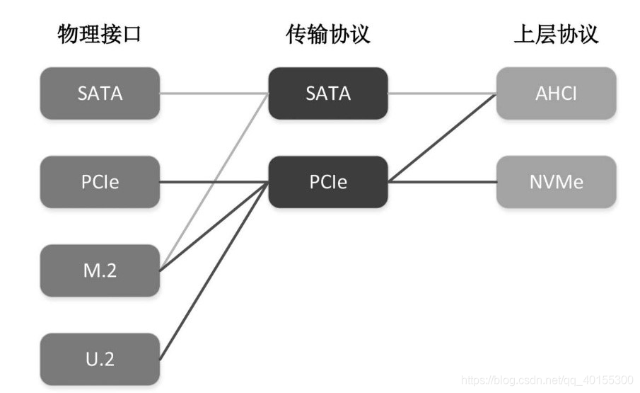
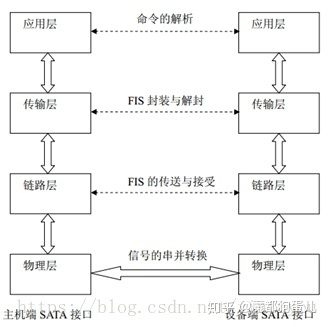

# 块设备驱动

在上小节中完成了PCI设备的探测，文末介绍了设备配置的一点相关内容，在这一节，我们需要争对SATA设备进行配置，在PCI设备扫描中，当我们探测到了SATA设备时，会进行中断配置

```rust
if dev.id.class == 0x01 && dev.id.subclass == 0x06 {
            // Mass storage class, SATA subclass
            if let Some(BAR::Memory(pa, len, _, _)) = dev.bars[5] {
                info!("Found AHCI device");
                // 检查status的第五位是否为1，如果是，则说明该设备存在能力链表
                if dev.status | Status::CAPABILITIES_LIST == Status::empty() {
                    info!("\tNo capabilities list");
                    return None;
                }
                unsafe { enable(dev.loc) };
                assert!((len as usize) < PAGE_SIZE);
                if let Some(x) = AHCIDriver::new(pa as usize, len as usize) {
                    return Some(x);
                }
            }
        }
```

通过class 和subclass字段的对应值，判断是否找到SATA设备，并检查设备是否存在能力链表，如果存在那么我们将会配置MSI中断

```rust
unsafe fn enable(loc: Location) {
    let ops = &UnusedPort;
    let am = CSpaceAccessMethod::MemoryMapped;
    // 23 and lower are used
    static mut MSI_IRQ: u32 = 23;

    let orig = am.read16(ops, loc, PCI_COMMAND);
    // bit0     |bit1       |bit2          |bit3           |bit10
    // IO Space |MEM Space  |Bus Mastering |Special Cycles |PCI Interrupt Disable
    am.write32(ops, loc, PCI_COMMAND, (orig | 0x40f) as u32);
	//0100 0000 1111
    // find MSI cap
    let mut msi_found = false;
    let mut cap_ptr = am.read8(ops, loc, PCI_CAP_PTR) as u16; // 能力链表的起始地址
    while cap_ptr > 0 {
        // info!("cap_ptr: {:#x}", cap_ptr);
        let cap_id = am.read8(ops, loc, cap_ptr);
        if cap_id == PCI_CAP_ID_MSI {
            let orig_ctrl = am.read32(ops, loc, cap_ptr + PCI_MSI_CTRL_CAP);

            // 在 3A+7A 的系统中，PCI MSI 中断的目标地址为 0xfdf8000000 或者 0x2ff00000。桥片会将设
            // 备发给这两个地址段的 MSI 消息包，转换成 HT 中断消息包，发送给处理器。
            am.write32(ops, loc, cap_ptr + PCI_MSI_ADDR, 0x2ff0_0000); // 设置MSI的地址
            MSI_IRQ += 1;
            let irq = MSI_IRQ;
            //检查是64位/32位模式
            // we offset all our irq numbers by 32
            if (orig_ctrl >> 16) & (1 << 7) != 0 {
                // 64bit
                am.write32(ops, loc, cap_ptr + PCI_MSI_DATA_64, irq + 32);
            } else {
                // 32bit
                am.write32(ops, loc, cap_ptr + PCI_MSI_DATA_32, irq + 32);
            }

            // enable MSI interrupt, assuming 64bit for now
            am.write32(ops, loc, cap_ptr + PCI_MSI_CTRL_CAP, orig_ctrl | 0x10000);
            msi_found = true;
        }
        cap_ptr = am.read8(ops, loc, cap_ptr + 1) as u16;
    }

    if !msi_found {
        info!("MSI not found");
        // Use PCI legacy interrupt instead
        // IO Space | MEM Space | Bus Mastering | Special Cycles
        am.write32(ops, loc, PCI_COMMAND, (orig | 0xf) as u32);
    }
}
```

- 第10行中根据命令寄存器的含义写入特定值，这里主要是关闭传统中断
- 第14行读取能力链表的起始位置
- 第18行检查是否支持MSI中断
- 第23行根据loongarch的7a1000桥片设置中断消息目标地址
- 第30/33设置irq
- 第37行启用MSI中断
- 第47行如果发现不支持MSI中断则使用默认中断


## SATA协议与AHCI协议



SATA接口协议借鉴TCP/IP模型，将SATA接口划分为四个层次来实现，包括物理层、链路层、传输层、应用层，其体系结构如图所示:



物理层采用全双工串行传输方式，主要功能是进行信号的串并及并串转化。物理层接收来自链路层的数据信息，将接收到的并行的数字逻辑信号转换为串行的差分物理信号，发送到主机端。相应的物理层能将来自主机端的串行差分物理信号转化为并行的逻辑信号传送到链路层

链路层的主要功能是通过控制原语的传递来控制信息帧的整个传输过程，保证帧信息能够正确的发送与接收并能进行流量的控制，防止数据发送过快或接受过多。

传输层主要负责FIS帧信息结构的封装与解封。
1）传输层接收到来自应用层的数据传输操作请求后，将相关寄存器中信息按SATA协议规定的标准格式封装为FIS传递给链路层。当链路层正确接收完成后，能给传输层反馈成功完成本次传输的信号。
2）传输层接收到来自链路层的SOF信号后，能接收FIS信息帧，并能判断该FIS的类型，根据FIS类型，判断该FIS是否是有效的FIS。如果是则将该FIS中的命令和数据等按照SATA协议规定进行解析，映射到各个寄存器中，然后能通知应用层接收相应寄存器的值。如果该FIS无效，则丢弃。

应用层能够进行接受来自主机端的命令，根据命令的要求将自身的信息发送给主机端，或是接收来自主机端的以PIO或DMA方式传输的数据,同时写入闪存中，也能从闪存中以PIO或DMA的方式读出数据，传送给主机端。在应用层采用两个FIFO对数据进行缓冲，一个为读FIFO，一个为写FIFO。应用层能接收来自传输层的数据帧送入写FIFO中或将来自总线的数据保存在读FIFO中，然后通知传输层构造数据帧。

AHCI（高级主机控制器接口）由 Intel 开发，以方便处理 SATA 设备。AHCI 规范强调 AHCI 控制器（称为主机总线适配器，或 HBA）被设计为系统内存和 SATA 设备之间的数据移动引擎。它封装了 SATA 设备，并为主机提供了标准的 PCI 接口。系统设计人员可以使用系统内存和内存映射寄存器轻松访问 SATA 驱动器，而无需像 IDE 那样处理烦人的任务文件。AHCI 控制器最多可支持 32 个端口，这些端口可以连接不同的 SATA 设备，例如磁盘驱动器、端口倍增器或机箱管理桥。AHCI 支持所有原生 SATA 功能，例如命令队列、热插拔、电源管理等。对于软件开发人员而言，AHCI 控制器只是具有总线主控功能的 PCI 设备。

简单来说，AHCI的抽象层次更高，作为开发者来说可以直接操作AHCI完成硬盘的读写。

主机通过系统内存和内存映射寄存器与 AHCI 控制器通信。最后一个PCI基地址寄存器(BAR[5], header offset 0x24)指向AHCI基内存，称为ABAR(AHCI Base Memory Register)。所有 AHCI 寄存器和存储器都可以通过 ABAR 定位。在上面代码中我们也获取了BAR[5]的基地址和大小并根据此构建AHCI,这里我们不深入讲解AHCI协议的内容，文末会给出链接给想了解的同学。

SATA设备使用DMA的方式进行硬盘的读取，因此需要我们在内存中分配相应的区域，这需要我们为其实现相应的接口:

```rust
impl provider::Provider for Provider {
    const PAGE_SIZE: usize = PAGE_SIZE;
    fn alloc_dma(size: usize) -> (usize, usize) {
        let pages = size / PAGE_SIZE;
        let mut base = 0;
        for i in 0..pages {
            let frame = frame_alloc().unwrap();
            let frame_pa: PhysAddr = frame.ppn.into();
            let frame_pa = frame_pa.into();
            core::mem::forget(frame);
            if i == 0 {
                base = frame_pa;
            }
            assert_eq!(frame_pa, base + i * PAGE_SIZE);
        }
        let base_page = base / PAGE_SIZE;
        info!("virtio_dma_alloc: {:#x} {}", base_page, pages);
        (base, base)
    }

    fn dealloc_dma(va: usize, size: usize) {
        info!("dealloc_dma: {:x} {:x}", va, size);
        let pages = size / PAGE_SIZE;
        let mut pa = va;
        for _ in 0..pages {
            frame_dealloc(PhysAddr::from(pa).into());
            pa += PAGE_SIZE;
        }
    }
}
```

主要就是需要保证在进行分配时需要保证页帧的连续性，并且由于生命周期的原因，alloc_dma函数结束后，由于没有明确的保存申请的物理页帧，因此可能会被回收掉，这里使用第十行使用`core::mem::forget(frame)`使得编译期忽略掉页帧，即不会对其调用drop进行回收。


## 参考链接

[SATA](https://wiki.osdev.org/SATA)

[AHCI](https://wiki.osdev.org/AHCI)

[AHCI](https://serial-ata-ahci-cn.readthedocs.io/zh_CN/latest/ch1/)
