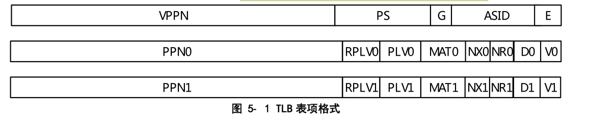
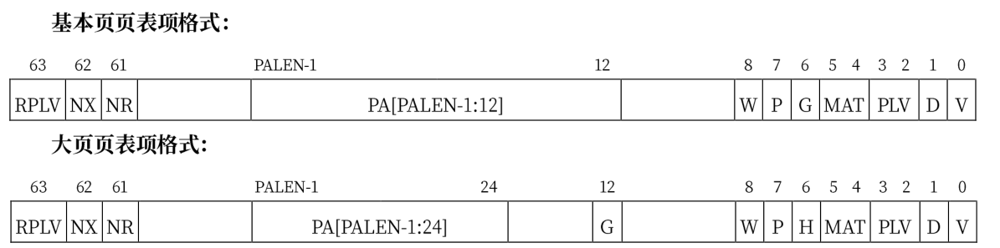

# 第四章

loongArch作为一种risc体系，其与mips/risc-v一样具有32个通用寄存器。 定义了4 个运行特权等级（Privilege LeVel，简称 PLV），分别是 PLV0~PLV3。通常而言特权资源不可以被运行在非特权等级的应用软件直接访问，但是当 CSR.MISC 中的RPCNTL1/RPCNTL2/RPCNTL3 配置为 1 时，可以在 PLV1/PLV2/PLV3 特权等级下执行 CSRRD 指令读取性能监测计数器。在上电复位时某些非特权功能会被默认开启，可以通过将 CSR.MISC 中DRDTL1/DRDTL2/DRDTL3 位置 1，可以禁止在 PLV1/PLV2/PLV3 级下执行 RDTIME 类指令，违例将触发指令特权等级错例外（IPE）。

## 存储访问类型

loongArch支持三种存储访问类型:

- 一致可缓存（Coherent Cached，简称 CC )
- 强序非缓存（Strongly-ordered UnCached，简称 SUC）
- 弱序非缓存（Weakly-ordered UnCached，简称 WUC）

三种访问类型通过页表项的控制位MAT决定，MAT的值和对应关系如下:

| MAT  | 类型 |
| :--: | :--: |
|  0   | SUC  |
|  1   |  CC  |
|  2   | WUC  |
|  3   | 保留 |

​	其中的一致可缓存就与正常的存储访问一样，访问的内容既可以来自于内存也可以来自缓存。通常采用这种访问类型访问内存以获得高性能。

​	采用强序非缓存或弱序非缓存类型访问时，只能直接访问最终存储对象。两者的区别在于：强序非缓存访问满足顺序一致性，即所有访问严格按照程序中的次序执行且当前访存操作彻底完成前不能开始执行下一个访存操作；而弱序非缓存的读访问允许推测执行，弱序非缓存的写数据可以在处理器核内部合并至更大的规模（如一个 Cache 行）后以突发Burst）方式写出，合并过程中后面的写数据可以覆盖前面写数据。这两种模式在本实验中并不会涉及。

**例外**：

对于系统软件，其在直接地址翻译模式下，或是映射地址翻译模式下地址落在直接映射窗口所配置的地址范围内，其存储访问类型由指定的控制状态寄存器进行配置。


## CPUCFG

CPUCFG 指令用于软件在执行过程中动态识别所运行的处理器中实现了龙芯架构中的哪些功能特性。这些指令系统功能特性的实现情况记录在一系列配置信息字中，CPUCFG 指令执行一次可以读取一个配置信息字。

在本实验中，使用此指令读出时钟的频率以及分频系数和倍频因子。

## 内存管理

龙芯架构下内存地址空间是一个字节寻址的线性连续地址空间。
在 LA32 架构下，应用软件能够访问的内存地址空间范围是：$0 - 2^{31}-1$。
在 LA64 架构下，应用软件能够访问的内存地址空间范围是：$0-2^{VALEN-1}-1$。这里 VALEN 理论上是一个小于等于 64 的整数，由实现决定其具体的值。常见的 VALEN 在[40, 48]范围内。应用软件可以通过执行 CPUCFG指令读取 0x1 号配置字的 VALEN 域来确定 VALEN 的具体值。当应用软件中取指或访存指令的虚地址超过了上述范围，将触发取指地址错例外（ADEF）或访存指令地址错例外（ADEM）。


## 虚拟地址管理

读取CPU配置字可以获取支持的物理地址范围PALEN和虚拟地址范围VLEN。在qemu上两者均为47位。

缺省状态下，LA64的整个虚拟地址空间配置如下：

| 区段名     | 地址范围                                | 属性                            |
| ---------- | --------------------------------------- | ------------------------------- |
| `XUVRANGE` | 0x0000000000000000 - 0x3FFFFFFFFFFFFFFF | 分页映射, 可缓存, PLV0~3        |
| `XSPRANGE` | 0x4000000000000000 - 0x7FFFFFFFFFFFFFFF | 直接映射, 可缓存 / 非缓存, PLV0 |
| `XKPRANGE` | 0x8000000000000000 - 0xBFFFFFFFFFFFFFFF | 直接映射, 可缓存 / 非缓存, PLV0 |
| `XKVRANGE` | 0xC000000000000000 - 0xFFFFFFFFFFFFFFFF | 分页映射, 可缓存, PLV0          |

用户态（PLV3）只能访问XUVRANGE，对于直接映射的XSPRANGE和XKPRANGE，将虚拟地址的第 60-63位清零就等于物理地址，而其缓存属性是通过虚拟地址的第60~61位配置的（0表示强序 非缓存，1表示一致可缓存，2表示弱序非缓存）。

目前，我们仅用XKPRANGE来进行直接映射，XSPRANGE保留给以后用。

此处给出一个直接映射的例子：物理地址0x00000000_00001000的强序非缓存直接映射虚拟地址 （在XKPRANGE中）是0x80000000_00001000，其一致可缓存直接映射虚拟地址（在XKPRANGE中） 是0x90000000_00001000，而其弱序非缓存直接映射虚拟地址（在XKPRANGE中）是0xA0000000_ 00001000。

### 虚拟地址空间与地址翻译模式

​	龙芯架构的 MMU 支持两种虚实地址翻译模式：**直接地址翻译模式**和**映射地址翻译模式**

​	当 CSR.CRMD 的 DA=1 且 PG=0 时，处理器核的 MMU 处于直接地址翻译模式。在这种映射模式下，物理地址默认直接等于虚拟地址的[PALEN-1:0]位（不足补 0），除非具体实现中采用了其它优先级更高的虚实地址翻译规则。可以看到此时整个虚拟地址空间都是合法的。处理器复位结束后将进入直接地址翻译模式。

当 CSR.CRMD 的 DA=0 且 PG=1 时，处理器核的 MMU 处于映射地址翻译模式。具体又分为**直接映射地址翻译模式**（简称“直接映射模式”）和**页表映射地址翻译模式**（简称“页表映射模式”）两种。翻译地址时将优先看其能否按照直接映射模式进行翻译，无法进行后再按照页表映射模式进行翻译。

==注意==

LA64 架构下，采用页表映射模式时，虚拟地址空间合法性的判定规则：合法虚拟地址的[63:PALEN]位必须与[PALEN-1]位相同，即[PALEN-1]之上的所有位是其符号扩展，否则将触发地址错（ADE）例外。然而在直接映射模式下，就不需要进行这种地址非法性检查。

#### 直接映射地址翻译模式

​	通过配置4个映射窗口，可以直接将窗口内的虚拟地址转为物理地址。前两个窗口可同时用于取指和 load/store 操作，后两个窗口仅用于load/store 操作。系统软件通过配置 CSR.DMW0 ~ CSR.DMW3 寄存器来分别设置四个直接映射配置窗口。每个窗口除了地址
范围信息外，还可以配置该窗口在哪些特权等级下可用，以及虚地址落在该窗口上的访存操作的存储访问类型。

​	在 LA64 架构下，每一个直接映射配置窗口可以配置一个 $2^{PALEN}$字节固定大小的虚拟地址空间。当虚地址命中某个有效的直接映射配置窗口时，其物理地址直接等于虚地址的[PALEN-1:0]位。命中的判断方式是：虚地址最高 4 位（[63:60]位）与配置窗口寄存器中的 VSEG 域相等，且当前特权等级在该配置窗口中被允许。

​	

#### 页表映射地址翻译模式

​	映射地址翻译模式下，除了落在直接映射配置窗口中的地址之外，其余所有合法地址都必须通过页表映射完成虚实地址转换。TLB 作为处理器中存放操作系统页表信息的一个临时缓存，用于加速映射地址翻译模式下的取指和 load/store 操作的虚实地址转换过程。

​	龙芯架构下 TLB 分为两个部分，一个是所有表项的页大小相同的单一页大小 TLB（Singular-Page-Size TLB，简称 STLB），另一个是支持不同表项的页大小可以不同的多重页大小 TLB（Multiple-Page-Size TLB，简称 MTLB）。

​	页大小与 STLB 所配置的页大小相同的页表项能否进入 MTLB，由实现决定，架构规范中不做限制.本实验中只使用单一页大小的SLTB。在虚实地址转换过程中，STLB 和 MTLB 同时查找。相应地，软件需保证不会出现 MTLB 和 STLB 同时命中的情况，否则处理器行为将不可知。由于不使用MLTB，这个要求自然得到了保证。

STLB 采用多路组相联的组织形式。对于 STLB，如果其有 $2^{INDEX}$组，且配置的页大小为 $2^{PS}$字节，那么硬件查询 STLB 的过程中，是将虚地址的[PS+INDEX:PS+1]位作为索引值来访问各路信息的。

#### TLB表项

STLB与MLTB的表项基本一致，这里关注SLTB表项，对于 STLB 来说，其存放的页表项的页大小是由系统软件配置在 CSR.STLBPS 寄存器的 PS 域。SLTB格式包含两个部分：比较部分和物理转换部分。



TLB 表项的比较部分包括:

- 存在位(E)，1 比特。为 1 表示所在 TLB 表项非空，可以参与查找匹配
- 地址空间标识(ASID)，10 比特。地址空间标识用于区分不同进程中的同样的虚地址，避免进程切换时清空整个 TLB 所带来的性能损失。操作系统为每个进程分配唯一的 ASID，TLB 在进行查找时除了比对地址信息一致外，还需要比对 ASID 信息
- 全局标志位(G)，1 比特。当该位为 1 时，查找时不进行 ASID 是否一致性的检查。当操作系统需要在所有进程间共享同一虚拟地址时，可以设置 TLB 页表项中的 G 位置为 1。
- 页大小(PS)，6 比特。仅在 MTLB 中出现。用于指定该页表项中存放的页大小。数值是页大小的 2的幂指数。即对于 16KB 大小的页，PS=14。
- 虚双页号(VPPN)，(VALEN-13)比特。在龙芯架构中，每一个页表项存放了相邻的一对奇偶相邻页表信息，所以 TLB 页表项中存放虚页号的是系统中虚页号/2 的内容，即虚页号的最低位不需要存放在 TLB 中。查找 TLB 时在根据被查找虚页号的最低位决定是选择奇数号页还是偶数号页的物理转换信息。

表项的物理转换部分存有一对奇偶相邻页表的物理转换信息，每一个页的转换信息包括:

- 有效位(V)，1 比特。为 1 表明该页表项是有效的且被访问过的。
- 脏位(D)，1 比特。为 1 表示该页表项项所对应的地址范围内已有脏数据。
- 不可读位(NR)，1 比特。为 1 表示该页表项所在地址空间上不允许执行 load 操作。该控制位仅定1义在 LA64 架构下。
- 不可执行位(NX)，1 比特。为 1 表示该页表项所在地址空间上不允许执行取指操作。该控制位仅定义在 LA64 架构下。
- 存储访问类型(MAT)，2 比特。控制落在该页表项所在地址空间上访存操作的存储访问类型
- 特权等级（PLV），2 比特。该页表项对应的特权等级。当 RPLV=0 时，该页表项可以被任何特权等级不低于 PLV 的程序访问；当 RPLV=1 时，该页表项仅可以被特权等级等于 PLV 的程序访问
- 受限特权等级使能（RPLV），1 比特。页表项是否仅被对应特权等级的程序访问的控制位。该控制位仅定义在 LA64 架构下
- 物理页号(PPN)，(PALEN-12)比特。当页大小大于 4KB 的时候，TLB 中所存放的 PPN 的[log2PS-1:12]位可以是任意值


​	处理器用地址空间标识符（Address Space Identifier，简称 ASID）和虚拟页号（Virtual Page Number，简称 VPN）在 TLB 中进行查找匹配，若命中则读出其中的物理页号（Physical Page Number，简称 PPN）和标志位（Flag）。标志位用于判断该访问是否合法，一般包括是否可读、是否可写、是否可执行等，若非法则发出非法访问异常；物理页号用于和页内偏移（Offset）拼接组成物理地址。若未在 TLB中命中，则需要将页表内容从内存中取出并填入 TLB 中，这一过程通常称为 TLB 重填（TLB Refill）。TLB 重填可由硬件或软件进行，例如 X86、ARM 处理器采用硬件 TLB 重填，即由硬件完成页表遍历（Page Table Walker），将所需的页表项填入 TLB 中；而MIPS、LoongArch 处理器默认采用软件 TLB 重填，即查找 TLB 发现不命中时，将触发 TLB 重填异常，由异常处理程序进行页表遍历并进行 TLB 填入

### 系统启动与地址映射关系

​	UEFI bios装载内核时，会把从内核elf文件获取的入口点地址（可以用readelf -h或者-l vmlinux看到）抹去高32位使用。比如vmlinux链接的地址是0x9000000001034804，实际bios跳转的地址将是0x1034804，代码装载的位置也是物理内存0x1034804。BIOS这么做是因为它逻辑上相当于用物理地址去访问内存，高的虚拟地址空间没有映射不能直接用。在bios中会使得CRMD的PG = 1，DA = 0, DMW0配置为0x9000000000000011，这意味着此时开启了映射翻译模式，并且bios实现了TLB的重填异常。在实验中没有开启页表前我们将内核的链接地址设置为0x92000000，应用地址设置为0x93000000,因此两个地址都没有落入直接映射地址空间，但由于bios已经实现了在TLB重填处理中将访问到的虚拟地址全部对应到相同的物理地址，因此系统可以正常的运行。我们也可以设置PG = 0, DA = 1,此时程序的运行就会将虚拟地址作为物理地址对待，与TLB重填处理一样，也可以正常运行。在实验开始管理内存和开启页表后，


### 页表项




# 第五章

### 问题1: 在用户程序`matrix`实现中，如果是如下的代码:

```rust
println!("pid {} is running ({} times)!.", getpid(), times);
```

则会造成页错误,如果改成如下的代码:

```rust
println!("yield began");
yield_();
println!("pid {} is running ({} times)!.", getpid(), times);
```

则会运行通过。


解决思路1: 在任务切换时是否正确进行了相关寄存器的设置？

实际效果: 以第一种代码为例，在设置正确寄存器后，虽然可以正常打印这句话，但是后面仍然会造成指令不存在的错误

解决思路2：删除掉第二中的添加的打印语句，改成如下的语句:

```rust
let mut i = 2;
yield_();
println!("pid {} is running ({} times {})!.", getpid(), times,i);
```

效果:

在这种情况下，将会发生访问的地址出现错误的情况，此时出错地址不在正常的地址空间中。

==debug过程:==

在TLB重填处理函数中将出错地址打印出来，通过观察，此地址应该属于内核区域，因此不会在对应的应用程序的地址空间找到对应的页表项。而应用程序这里出错的位置是打印函数`println`，因此推测可能是`print`函数实现有错误，再去查看rcore的源代码后发现`print/println`的实现确实有过更改，因此这里就暂时将实现修改，在测试后发现居然可以正常运行了，因此就需要仔细对比前后两者的实现了。

老版本实现：

```rust
#[macro_export]
macro_rules! print {
    ($($arg:tt)*) => ($crate::print::_print(format_args!($($arg)*)));
}
#[macro_export]
macro_rules! println {
    () => ($crate::print!("\n"));
    ($($arg:tt)*) => ($crate::print!("{}\n", format_args!($($arg)*)));
}
```

新版本实现:

```rust
macro_rules! print {
    ($fmt: literal $(, $($arg: tt)+)?) => {
        $crate::print::_print(format_args!($fmt $(, $($arg)+)?));
    }
}

#[macro_export]
/// println string macro
macro_rules! println {
    ($fmt: literal $(, $($arg: tt)+)?) => {
        $crate::print::_print(format_args!(concat!($fmt, "\n") $(, $($arg)+)?));
    }
}

```

两者实现差异:

todo!

通过再次测试，又发现当TLB重填处理过程单独出来时，仍然会造成其它错误，而当将TLB重填过程与之前的中断和异常处理的入口设置为同一个，这时又不会造成错误，因此这里也需要观察两个方法实现的差异。

todo!

