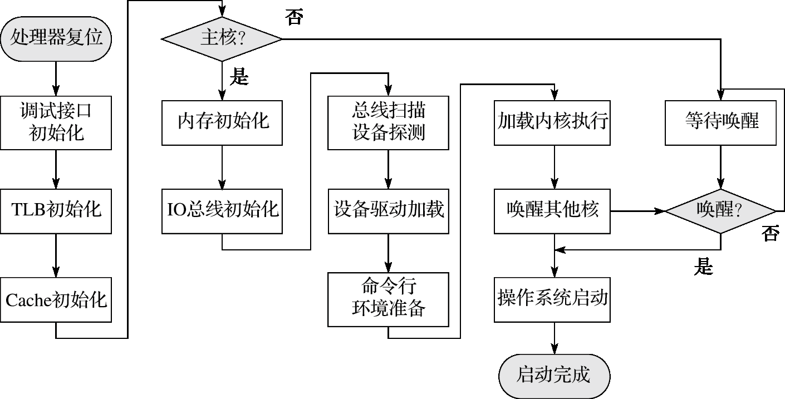
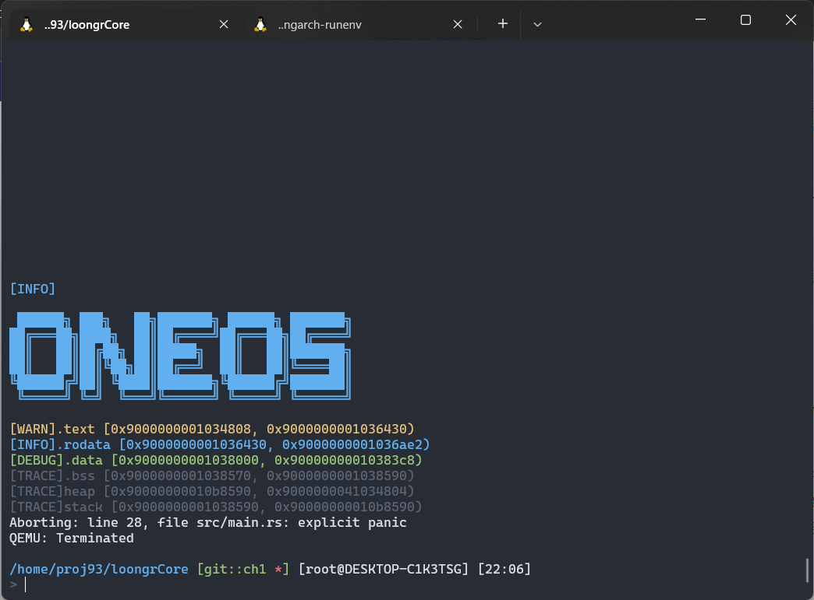

# 实验手册

实验手册用于记录实验过程中学习的相关知识和遇到的问题与解决方法

[TOC]

## UEFI与BIOS

BIOS（Basic Input/Output System），即基本输入输出系统，亦称为ROM BIOS、System BIOS、PC BIOS，是在通电启动阶段执行硬件初始化，以及为操作系统提供运行时服务的固件。以前的BIOS主要位于ROM上，现在则主要位于flash中。其主要执行的任务有

- 自检程序，用于检测硬件
- 初始化系统的处理器核、内存、外设等在内的各个部分
- 基本的I/O处理
- 外设驱动管理

在计算机按下电源键开机后，cpu将会跳转到某个固定的位置，即BIOS所在的位置，然后开始执行此位置的代码完成上述功能，在执行无误后，就会跳转到可以引导操作系统启动的Bootloader部分。

UEFI(Unified Extensible Firmware Interface)中文统一可扩展固件接口，UEFI主要定义了操作系统和平台固件之间的接口，UEFI只是一种标准，具体的实现由其他公司或开源组成提供。UEFI与BIOS显著的区别就是UEFI是用模块化，C语言风格的参数堆栈传递方式，动态链接的形式构建的系统，较BIOS而言更易于实现，容错和纠错特性更强，缩短了系统研发的时间。两者在完成的功能上是大同小异的。

UEFI系统从加电到关机分为7个阶段

- SEC(安全验证)
- PEI(EIF前期初始化)
- DXE(驱动执行环境)
- BDS(启动设备选择)
- TSL(操作系统前期加载)
- RT(运行时)
- AL(系统灾难恢复期)


## 操作系统的启动过程示意图

龙芯平台上的操作系统启动过程




UEFI bios装载内核时，会把从内核elf文件获取的入口点地址（可以用readelf -h或者-l vmlinux看到）抹去高32位使用。比如vmlinux链接的地址是0x9000000001034804，实际bios跳转的地址将是0x1034804，代码装载的位置也是物理内存0x1034804。BIOS这么做是因为它逻辑上相当于用物理地址去访问内存，高的虚拟地址空间没有映射不能直接用。

内核启动入口代码需要做两件事：

1. 设置一个直接地址映射窗口，把内核用到的64地址抹去高位映射到物理内存。目前linux内核是设置0x8000xxxx-xxxxxxxx和0x9000xxxx-xxxxxxxx地址抹去最高的8和9为其物理地址，前者用于uncache访问(即不通过高速缓存去load/store)，后者用于cache访问。
2. 做个代码自跳转，使得后续代码执行的PC和链接用的虚拟地址匹配。BIOS刚跳转到内核时，用的地址是抹去了高32位的地址（相当于物理地址），步骤1使得链接时的高地址可以访问到同样的物理内存，这里则换回到原始的虚拟地址。

在linux源代码中可以得到入口代码如下所示:

```gas
SYM_CODE_START(kernel_entry)			# kernel entry point
	la.abs		t0, 0f
	jirl		zero, t0, 0 
0:
	la		t0, __bss_start		# clear .bss
	st.d		zero, t0, 0
	la		t1, __bss_stop - LONGSIZE
1:
	addi.d		t0, t0, LONGSIZE
	st.d		zero, t0, 0
	bne		t0, t1, 1b

	#设置直接地址映射窗口
	li.d		t0, CSR_DMW0_INIT	# UC, PLV0, 0x8000 xxxx xxxx xxxx
	csrwr		t0, LOONGARCH_CSR_DMWIN0
	li.d		t0, CSR_DMW1_INIT	# CA, PLV0, 0x9000 xxxx xxxx xxxx
	csrwr		t0, LOONGARCH_CSR_DMWIN1
	#开启页表
	li.w		t0, 0xb0		# PLV=0, IE=0, PG=1
	csrwr		t0, LOONGARCH_CSR_CRMD
	li.w		t0, 0x04		# PLV=0, PIE=1, PWE=0
	csrwr		t0, LOONGARCH_CSR_PRMD
	li.w		t0, 0x00		# FPE=0, SXE=0, ASXE=0, BTE=0
	csrwr		t0, LOONGARCH_CSR_EUEN

	#设置栈空间
	PTR_LI		sp, (_THREAD_SIZE - 32 - PT_SIZE)
	PTR_ADDU	sp, sp, tp
	set_saved_sp	sp, t0, t1
	PTR_ADDIU	sp, sp, -4 * SZREG	# init stack pointer

	#跳转到内核入口
	bl		start_kernel

SYM_CODE_END(kernel_entry)
```

虽然得到了入口代码，但此代码不能直接copy到rust的实现中，因为上面的代码中包含了许多宏定义，而且这里可以使用的指令在rust中也并不能使用，因此我们需要将得到的可执行文件反汇编，得到原始的汇编代码。使用命令

```
loongarch64-unknown-linux-gnu-objdump -d vmlinux > linux.S
```

通过查找linux内核代码相关文件，找到了CSR_DMW0_INIT的相关定义，其值为0x180，也即是DMW0寄存器的地址。因此可以在汇编代码中查找0x180所在位置，得到设置映射窗口的相关代码:

```
#初始化bss段
90000000010347f4:       1c00d68c        pcaddu12i       $t0, 1716(0x6b4)
90000000010347f8:       02d7318c        addi.d          $t0, $t0, 1484(0x5cc)
90000000010347fc:       28c1e184        ld.d            $a0, $t0, 120(0x78)
9000000001034800:       4c000020        jirl            $zero, $ra, 0
9000000001034804:       1402068c        lu12i.w         $t0, 4148(0x1034)
9000000001034808:       03a0618c        ori             $t0, $t0, 0x818
900000000103480c:       1600000c        lu32i.d         $t0, 0
9000000001034810:       0324018c        lu52i.d         $t0, $t0, -1792(0x900)
9000000001034814:       4c000180        jirl            $zero, $t0, 0
9000000001034818:       1c00c76c        pcaddu12i       $t0, 1595(0x63b)
900000000103481c:       02dfa18c        addi.d          $t0, $t0, 2024(0x7e8)
9000000001034820:       29c00180        st.d            $zero, $t0, 0
9000000001034824:       1c00e7ad        pcaddu12i       $t1, 1853(0x73d)
9000000001034828:       02fcf1ad        addi.d          $t1, $t1, -196(0xf3c)

#bne if t0 < t1 则跳转
#st.d 将 zero的内容写入内存中，内存地址由 t0+(0符号扩展）
900000000103482c:       02c0218c        addi.d          $t0, $t0, 8(0x8)
9000000001034830:       29c00180        st.d            $zero, $t0, 0
9000000001034834:       5ffff98d        bne             $t0, $t1, -8(0x3fff8)

#设置映射窗口
9000000001034868:       0380040c        ori             $t0, $zero, 0x1
900000000103486c:       0320018c        lu52i.d         $t0, $t0, -2048(0x800)
9000000001034870:       0406002c        csrwr           $t0, 0x180
9000000001034874:       0380440c        ori             $t0, $zero, 0x11
9000000001034878:       0324018c        lu52i.d         $t0, $t0, -1792(0x900)
900000000103487c:       0406042c        csrwr           $t0, 0x181
```

综合以上信息并查找相关资料，我们重写得到的内核入口代码如下所示:

```
.section .text.init
.global _start

_start:
0:
    #设置映射窗口
    ori $t0, $zero,0x1
    lu52i.d $t0, $t0, -2048 #加载立即数
    csrwr $t0,0x180  #设置LOONGARCH_CSR_DMWIN0 #特权指令用于交换两个寄存器内容
    ori $t0, $zero,0x11
    lu52i.d $t0, $t0, -1792
    csrwr $t0,0x181 #LOONGARCH_CSR_DMWIN1
1:
    la.global $t0, _bss_start
    la.global $t1, _bss_end
    bgeu $t0, $t1, 3f   #bge如果前者大于等于后者则跳转
2:
    st.d $zero, $t0,0
    addi.d $t0, $t0, 8
    bltu $t0, $t1, 2b
3:
    la.global $sp, _stack # _stack 在linker.ld文件中分配，这里用于分配栈空间
    bl main #跳转到main入口开始执行
```

在实验中，需要使用串口打印信息以便于后期实验，在rCore第一章中使用的是SBI提高的运行时服务，这里由于调用UEFI提供的服务比较困难，因此我们尝试了使用uart_16550库提供的接口，但发现并不能正常使用，因此这里实现了一个简单的uart模块。在使用我们编写的串口输出后，可以正常显示和输入



