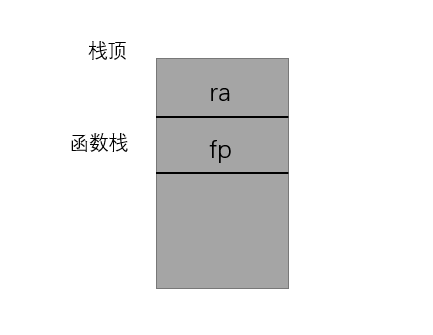

# 使用说明

此工具用于在`rCore` panic时进行堆栈回溯，打印函数调用路径。目前只在ch9分支上进行测试，从ch6开启文件系统后均可以使用此工具。

## 如何获取函数信息

在栈回溯时，需要查询函数信息，而这些函数信息主要包含于可执行文件中。具体的细节可以在[elf文件函数信息](https://blog.csdn.net/Chasing_Chasing/article/details/96750109)这里查看，这里给出主要的查找过程


由于`rust`会对函数名称进行重整，类似于c++，因此需要使用相应工具进行解析才能转为可读的名称。同时，汇编文件中的函数可能不会被上述过程收集到。

## 栈回溯分类

主要有两种堆栈回溯方式，一种是使用`sp`和`fp`指针进行回溯，如下图所示，在这种方式下，每当函数进行开辟栈帧操作后，就会保存`ra` `tp`的值，然后令`fp`指向当前的栈顶，



在这种情况下，在进行栈回溯时，首先根据`fp`寄存器指向的地址，取出保存在函数栈中`ra`和`fp`寄存器的数据,`ra`的值是函数返回地址，`fp`的值是上一级函数栈的栈顶地址,根据`ra`的值到收集的函数信息中查找此地址是否位于某个函数的范围，如果是，则记录函数信息，然后根据`fp`回到上一级函数，继续读取`ra`和`fp`的值，指导无法找到对应的函数区间。

第二种回溯方式是由于某些编译器不会利用`fp`生成上述的代码，从而需要额外的手段进行解析，有的会使用ELF文件中的`.eh_frame`段内容，由于这些方式比较复杂，因此本工具暂不使用此方法。


## 本工具回溯方法

本工具根据一般函数生成形式，比如rust生成的一段`risc-v`代码如下

```
0000000080210412 <my_trace>:
    80210412:   7149                    addi    sp,sp,-368
    80210414:   f686                    sd      ra,360(sp)
    80210416:   f2a2                    sd      s0,352(sp)
    80210418:   eea6                    sd      s1,344(sp)
    8021041a:   eaca                    sd      s2,336(sp)
    8021041c:   e6ce                    sd      s3,328(sp)
    8021041e:   e2d2                    sd      s4,320(sp)
    80210420:   fe56                    sd      s5,312(sp)
    80210422:   fa5a                    sd      s6,304(sp
```

可以看到，函数的前两条指令是开辟栈空间和保存`ra`的指令，因此这里一个简单的想法就是通过读取函数的第一条指令和第二条指令，获取到开辟的栈空间大小以及`ra`存储的位置，这里`ra`一般就是存储在栈顶，读取第二条指令主要是确保这条指令是保存`ra`的指令。再使用汇编指令读取当前的`sp`值，就可以得到下面的回溯方式：

```
读取函数第一条指令和第二条指令获得栈大小size
栈底: sp
栈顶: sp + size
ra : m[sp+size-8]
寻找ra所在函数
将找到的函数设置为当前函数
再次重复上述过程
```

因此主要工作在于如何解析函数的第一条和第二条指令，通过查询risc-v手册可以找到各条指令的格式，比如`addi`指令的格式


读取第一条指令并按照上面的格式解析出立即数部分就可以得到栈大小，但由于risc-v的编译器会做某些优化，将`addi`指令使用压缩指令表示，而压缩指令一般是两字节格式，比如`c.addi`指令的格式如下:


因此需要根据压缩指令和未压缩的指令共同判断第一条指令是否未开辟栈空间的指令和栈空间大小。同理，判断第二条指令也需要如上的工作。

具体的实现请查看源代码。


## 使用方法

本工具以一个库的形式提供，需要传入的参数为OS的可执行文件。

```rust
#[panic_handler]
fn panic(info: &PanicInfo) -> ! {
    if let Some(location) = info.location() {
        println!(
            "[kernel] Panicked at {}:{} {}",
            location.file(),
            location.line(),
            info.message().unwrap()
        );
    } else {
        println!("[kernel] Panicked: {}", info.message().unwrap());
    }
    unsafe {
        backtrace();
    }
    shutdown(255)
}
use stack_trace::{Trace};
unsafe fn backtrace() {
    let mut os_name:Vec<&str> = Vec::new();
    let all_file = ROOT_INODE.ls();
    all_file.iter().for_each(|x| {
         if x.contains("os") {
             os_name.push(x);
         }
     });
    os_name.sort();//由于内核文件较大，会被分成多个文件
    let mut data = Vec::new();
    os_name.iter().for_each(|name|{
        let mut file = open_file(*name,OpenFlags::RDONLY).unwrap();
        let d = file.read_all();
        trace!("name: {} {}",name,d.len());
        data.extend_from_slice(d.as_slice());
    });//合并内核文件
    let mut trace = Trace::new();
    trace.init(data.as_slice());//初始化，传入内核可执行文件
    let road = trace.trace();//收集函数调用信息
    road.iter().for_each(|s|{
        println!("{}",s);
    });
}
```

目前的内核无法传递参数，为了在内核中读取本身的ELF文件，需要在编译后将ELF文件与应用程序文件一样打包在fs.img中，为了不将代码写死，这里在easy-fs-fuse添加了一个参数:

```rust
 .arg(
            Arg::with_name("kernel")
                .short("k")
                .long("kernel")
                .takes_value(true)
                .help("Kernel source dir(with backslash)"),
)
```

同时在os的Makefile文件也需要修改相应的参数:

```
@cd ../easy-fs-fuse && cargo run --release -- -s ../user/src/bin/ -t ../user/target/riscv64gc-unknown-none-elf/release/ -k ../os/target/riscv64gc-unknown-none-elf/release/
```

然后只需要在easy-fs-fuse将内核文件写入fs-img, 由于内核可执行文件高达16MB，并且os中文件系统最多支持8MB大小的文件，因此在打包时需要将文件进行切分，并且设置fs-img大小为32MB


```rust
 let kernel_path = matches.value_of("kernel").unwrap();
    println!("kernel path = {}{}",kernel_path,"os");
    let mut file = File::open(format!("{}{}", kernel_path, "os")).unwrap();
    let mut all_data: Vec<u8> = Vec::new();
    file.read_to_end(&mut all_data).unwrap();
    println!("{}", all_data.len());
    //如果数据大于8MB,将数据切分
    let mut data_vec: Vec<Vec<u8>> = Vec::new();
    let mut data_vec_len = 0;
    while data_vec_len < all_data.len() {
        let mut data_vec_tmp: Vec<u8> = Vec::new();
        data_vec_tmp.extend_from_slice(&all_data[data_vec_len..(data_vec_len + 8 * 1024 * 1024).min(all_data.len())]);
        data_vec.push(data_vec_tmp);
        data_vec_len += 8 * 1024 * 1024;
    }
    for i in 0..data_vec.len() {
        let inode = root_inode.create(format!("os{}", i).as_str()).unwrap();
        inode.write_at(0, data_vec[i].as_slice());
    }
```

完成上述步骤，就可以在内核中读取本身的ELF文件并传入栈回溯库了(内核读取这种大文件有点慢)

目前在内核中使用此功能可以达到的效果如下所示


## 注意事项

目前的实现仍然比较简陋，且限制较大，由于在出错时需要读取文件内容，此时如果发生任务调度可能会造成死锁的问题，但这是在ch9会发生的现象，如果在前面的章节中，读取文件内容是阻塞式的不会发生任务调度，因此应该不会造成死锁问题。


为了解决这个问题，可以在开始进入用户态之前就读取内核数据，后面如果发生错误，就不需要读取文件发生死锁。上面的代码修改为:

```rust
lazy_static!{
    static ref KERNEL_DATA: UPIntrFreeCell<Vec<u8>> = unsafe{UPIntrFreeCell::new(Vec::new())};
}
pub fn init_kernel_data(){
    let mut os_name:Vec<&str> = Vec::new();
    let all_file = ROOT_INODE.ls();
    all_file.iter().for_each(|x| {
        if x.contains("os") {
            os_name.push(x);
        }
    });
    os_name.sort();
    os_name.iter().for_each(|name|{
        let mut file = open_file(*name,OpenFlags::RDONLY).unwrap();
        let d = file.read_all();
        trace!("name: {} {}",name,d.len());
        KERNEL_DATA.exclusive_access().extend_from_slice(d.as_slice());
    });
}

unsafe fn backtrace() {
    let mut trace = Trace::new();
    trace.init(KERNEL_DATA.exclusive_access().as_slice());
    let road = trace.trace();
    road.iter().for_each(|s|{
        println!("{}",s);
    });
}
```

在main函数中，在开始进入用户程序之前调用`init_kernel_data()`即可。

## 改进

- [ ] 在编译前获取函数信息并与内核一同链接 --> 适用于所有章节的栈回溯方法
- [ ] 使用`.eh_frame`进行栈回溯而不是读取函数的前两条指令
