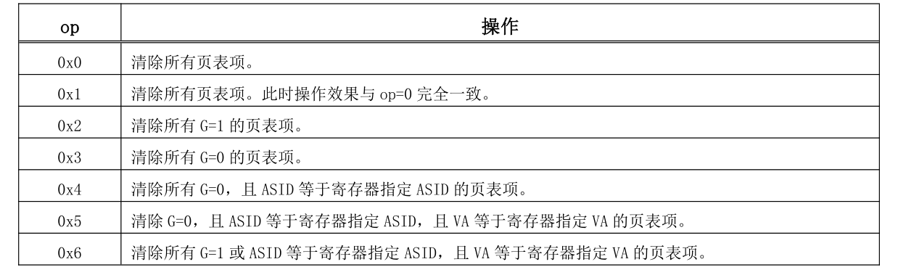

# fork和exec

进程的创建：

```rust
pub fn new(elf_data: &[u8]) -> Self {
    // memory_set with elf program headers/trampoline/trap context/user stack
    let (memory_set, user_sp, entry_point) = MemorySet::from_elf(elf_data);
    let task_status = TaskStatus::Ready; //准备状态
    let pid = pid_alloc(); //分配pid

    let kernel_stack = KernelStack::new(); //分配内核栈

    let kernel_trap_cx =
    kernel_stack.push_on_top(TrapContext::app_init_context(entry_point, user_sp));
    //在内核栈放入trap上下文
    let task_control_block = Self {
        pid,
        inner: unsafe {
            UPSafeCell::new(TaskControlBlockInner {
                kernel_stack,
                base_size: 0,
                task_cx: TaskContext::goto_restore(kernel_trap_cx as usize),
                //初始化任务上下文,参数为内核栈地址，内核栈存放的是trap上下文
                task_status,
                memory_set,
                parent: None,
                children: Vec::new(),
                exit_code: 0,
                stride: 0,
                pass: 0,
            })
        },
    };
    // prepare TrapContext in user space
    task_control_block
}
```

可以看到，相对于rcore中的实现来说，这里简化了许多，去掉了根据进程号申请内核栈的步骤，而是直接向内核申请内核栈，删除了trap页的初始化，此时trap上下文保存在内核栈顶。

```rust

pub fn fork(self: &Arc<TaskControlBlock>) -> Arc<TaskControlBlock> {
    // ---- access parent PCB exclusively
    let mut parent_inner = self.inner_exclusive_access();
    // copy user space(include trap context)
    let memory_set = MemorySet::from_existed_user(&parent_inner.memory_set);
    // alloc a pid and a kernel stack in kernel space
    let pid_handle = pid_alloc();
    //需要保证子进程与父进程的内核栈信息一样
    let kernel_stack = KernelStack::new();
    let kstack_ptr = kernel_stack.get_trap_addr();
    let task_control_block = Arc::new(TaskControlBlock {
        pid: pid_handle,
        inner: unsafe {
            let inner = UPSafeCell::new(TaskControlBlockInner {
                kernel_stack,
                base_size: parent_inner.base_size,
                task_cx: TaskContext::goto_restore(kstack_ptr),
                task_status: TaskStatus::Ready,
                memory_set,
                parent: Some(Arc::downgrade(self)),
                children: Vec::new(),
                exit_code: 0,
                stride: 0,
                pass: 0,
            });

            inner
        },
    });
    // add child
    task_control_block
    .inner_exclusive_access()
    .kernel_stack
    .copy_from_other(&parent_inner.kernel_stack);
    parent_inner.children.push(task_control_block.clone());
    task_control_block
}
```

在`fork`的实现中，由于在复制父进程地址空间时不会进行内核栈和trap页的映射，因此这里就需要将父进程的trap上下文直接复制到子进程的内核栈中从而可以让两者回到用户态的瞬间处于同一状态。

```rust
pub fn exec(&self, elf_data: &[u8]) {
        // memory_set with elf program headers/trampoline/trap context/user stack
        let (memory_set, user_sp, entry_point) = MemorySet::from_elf(elf_data);
        // **** access inner exclusively
        let mut inner = self.inner_exclusive_access();
        // substitute memory_set
        inner.memory_set = memory_set; //覆盖 memory_set
                                       // initialize trap_cx
        inner
            .kernel_stack
            .push_on_top(TrapContext::app_init_context(entry_point, user_sp));
        //由于切换了地址空间，因此之前的ASID对应的地址空间将不会再有用，因此这里需要将TLB中的内容无效掉
        let pid = self.getpid();
        unsafe {
            asm!("invtlb 0x4,{},$r0",in(reg) pid);
        }
        let pgd = inner.get_user_token() << PAGE_SIZE_BITS;
        Pgdl::read().set_val(pgd).write();
        // **** release inner automatically
    }
```

`exec`的实现中，差异主要来自于最后我们加入了TLB无效指令并且重新设置了根页表的地址。

指令格式： invtlb op, rj, rk

INVTLB 指令用于无效 TLB 中的内容。指令的三个源操作数中，op 是 5 比特立即数，用于指示操作类型。通用寄存器 rj 的[9:0]位存放无效操作所需的 ASID 信息（称为“寄存器指定 ASID”），其余比特必须填 0。当 op 所指示的操作不需要 ASID 时，应将通用寄存器 rj 设置为 r0。通用寄存器 rk 中用于存放无效操作所需的虚拟地址信息（称为“寄存器指定 VA”）。当 op 所指示的操作不需要虚拟地址信息时，应将通用寄存器 rk 设置为 r0



在fork完成后，子进程与父进程的地址空间是相同的，在执行exec后，子进程将重新创建地址空间，那么原来的虚拟地址可能在新的地址空间中与原来就不同了，此时就需要将原来已经存在的对应关系删除掉，在开启ASID的情况下，我们只需要根据进程号直接无效掉TLB中的表项即可，而地址空间的改变同时也需要设置根页表对应的寄存器，这样在回到用户态重新进行地址转换时才能正常进行。

在其它函数的实现中，一些需要注意的地方如下：

```rust
//  syscall/process/sys_fork
trap_cx.x[4] = 0; //x[4] is return value
add_task(new_task); // add new task to scheduler
new_pid as isize
```

在fork系统调用时，需要根据loongarch的寄存器做相应的设置

```rust
// task/mod/exit_current_and_run_next
// 使得原来的TLB表项无效掉，否则下一个进程与当前退出的进程号相同会导致
// 无法正确进行地址转换
unsafe {
asm!("invtlb 0x4,{},$r0",in(reg) pid);
}
```

在一个进程退出时，我们同样需要无效掉其对应的页表项，由于退出时进程的资源会被回收，那么在创建下一个进程时，就可能发生新进程会使用退出进程使用过的物理页，如果TLB中存在快照，就会造成访问错误，因此需要将退出进程在TLB中的快照删除。

