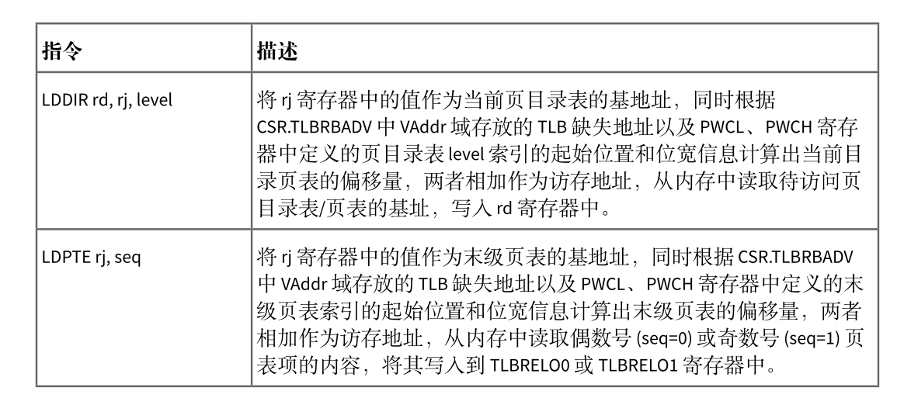

# 地址空间

在rcore中，在开启页表机制后，内核代码与应用程序代码均需要通过地址转换，因此在开启页表前需要为内核构建好地址空间。但是在loongarch平台上，有了前文所述的直接映射窗口机制，就可以免去构建内核地址空间的工作，只为用户程序构建地址空间。

在前面的实验中，内核与应用程序使用着BIOS提供的便利，直接访问着物理内存，因此应用程序就可以无视限制直接修改内存的内容，在这一章中，我们需要充分利用loongarch提供的直接映射窗口机制和页表对应用程序的内存访问做出限制，并且降低构建内核地址空间和应用地址空间的难度。

首先，内核地址空间由映射窗口完成映射，而不像rcore中建立恒等映射，但两者所起到的作用是一样的，即访问的虚拟地址就等于物理地址，因此，相对于前面的章节，本章在进入main函数前，需要设置直接映射窗口，实现如下：

```assembly
.section .text.init
.global _start

_start:
0:
    #设置映射窗口
    addi.d $t0,$zero,0x11
    csrwr $t0,0x180  #设置LOONGARCH_CSR_DMWIN0

    la.global $t0,1f
    jirl $zero, $t0,0
1:
    la.global $t0, sbss
    la.global $t1, ebss
    bgeu $t0, $t1, 3f   #bge如果前者大于等于后者则跳转
2:
    st.d $zero, $t0,0
    addi.d $t0, $t0, 8
    bltu $t0, $t1, 2b
3:
    bl main
```

上述汇编代码将0x11写入DMW0寄存器，那么0x0 - 0xFFFFFFFFFFFF的地址范围内，内核所在的特权级PLV0就可以对其进行任意的访问，在链接脚本中，我们指定了内核起始地址为  0x1000,在qemu模拟的地址空间中，0x0-0xfffffff范围为低256MB物理内存，本实验中也会只使用此范围的物理内存。 并且上述汇编也将bss段进行了初始化，在跳转到main函数后，内核代码就可以正常执行了。对于应用程序而言，由于映射窗口并没有设置特权级PLV3，而且此时开启了页表机制，因此如果从内核进入应用程序后，由于应用程序的地址空间不能匹配映射窗口，那么只能去查找TLB，而此时TLB中并不会包含如何信息，此时就会发生TLB重填例外，由我们将应用程序地址空间中对应页表项写入TLB。

有了直接映射窗口的实现，逻辑段和地址空间的抽象也需要做出相应的修改

```rust
pub struct MapArea {
    vpn_range: VPNRange,
    data_frames: BTreeMap<VirtPageNum, FrameTracker>,
    map_perm: MapPermission,
}
```

在逻辑段的定义中删除了map_type字段，因为此时不再区分恒等映射和非恒等映射，逻辑段只有应用程序的非恒等映射。

```rust
//  PTEFlags 的一个子集
// 主要含有几个读写标志位和存在位
bitflags! {
    pub struct MapPermission: usize {
        const NX = 1 << 62;
        const NR = 1 << 61;
        const W = 1 << 8;
        const PLVL = 1 << 2;
        const PLVH = 1 << 3;
        const RPLV = 1 << 63;
    }
}
impl Default for MapPermission {
    fn default() -> Self {
        MapPermission::PLVL | MapPermission::PLVH
    }
}
```

这里MapPermission设置为PTEFlags的一个子集，主要控制逻辑段的读写执行属性一级期望可以运行的特权级。其默认的实现需要设置访问的特权级为3。在`from_elf`映射应用程序地址空间时，一般不对RPLV设置，这样一来，在特权级1-3上也可以访问对应的页表项。

```rust
pub fn insert_area(&mut self, start_va: VirtAddr, end_va: VirtAddr, permission: MapPermission) {
        self.push(MapArea::new(start_va, end_va, permission), None);
    }
pub fn map_one(&mut self, page_table: &mut PageTable, vpn: VirtPageNum) {
    let ppn: PhysPageNum;
    let frame = frame_alloc().unwrap();
    ppn = frame.ppn;
    self.data_frames.insert(vpn, frame);
    let pte_flags = PTEFlags::from_bits(self.map_perm.bits).unwrap();
    page_table.map(vpn, ppn, pte_flags);
}
#[allow(unused)]
pub fn unmap_one(&mut self, page_table: &mut PageTable, vpn: VirtPageNum) {
    self.data_frames.remove(&vpn);
    page_table.unmap(vpn);
}
```

由于去掉了多余的映射方式，在实际进行映射和解映射时就可以删除掉多余的判断。`new_kernel`的实现也被从代码中删除。

```rust
pub fn from_elf(elf_data: &[u8]) -> (Self, usize, usize) {
    let mut memory_set = Self::new_bare();
    // map program headers of elf, with U flag
    let elf = xmas_elf::ElfFile::new(elf_data).unwrap();
    let elf_header = elf.header;
    let magic = elf_header.pt1.magic;
    assert_eq!(magic, [0x7f, 0x45, 0x4c, 0x46], "invalid elf!");
    let ph_count = elf_header.pt2.ph_count();
    let mut max_end_vpn = VirtPageNum(0);
    for i in 0..ph_count {
        let ph = elf.program_header(i).unwrap();
        if ph.get_type().unwrap() == xmas_elf::program::Type::Load {
            let start_va: VirtAddr = (ph.virtual_addr() as usize).into();
            let end_va: VirtAddr = ((ph.virtual_addr() + ph.mem_size()) as usize).into();
            let mut map_perm = MapPermission::default();
            let ph_flags = ph.flags();
            if !ph_flags.is_read() {
                map_perm |= MapPermission::NR;
            }
            if ph_flags.is_write() {
                map_perm |= MapPermission::W;
            } //可写
            if !ph_flags.is_execute() {
                map_perm |= MapPermission::NX;
            }
            let map_area = MapArea::new(start_va, end_va, map_perm);
            max_end_vpn = map_area.vpn_range.get_end();
            memory_set.push(
                map_area,
                Some(&elf.input[ph.offset() as usize..(ph.offset() + ph.file_size()) as usize]),
            );
        }
    }
    // map user stack with U flags
    let max_end_va: VirtAddr = max_end_vpn.into();
    let mut user_stack_bottom: usize = max_end_va.into();
    // guard page
    user_stack_bottom += PAGE_SIZE; //用户栈
    let user_stack_top = user_stack_bottom + USER_STACK_SIZE;
    memory_set.push(
        MapArea::new(
            user_stack_bottom.into(),
            user_stack_top.into(),
            MapPermission::default() | MapPermission::W,
        ),
        None,
    );
    //返回地址空间,用户栈顶,入口地址
    (
        memory_set,
        user_stack_top,
        elf.header.pt2.entry_point() as usize,
    )
}
```

在映射应用程序地址空间的实现中，主要的差异是MapPermission的设置以及比较重要的跳板页和Trap页映射，可以看到，上文中并没有映射这两个页。对于rcore来说，由于地址空间的切换需要在进行trap上下文保存和恢复时进行，而如果将trap上下文保存到内核栈上的话，只有一个sscratch寄存器将无法进行周转，因此其实现中为了保证在切换地址空间时保证指令执行的连续在应用程序地址空间和内核地址空间的最高部分设置了一个跳板页，并且将trap上下文保存在了应用程序的一个虚拟页面中。而在loongarch上，由于切换到内核地址空间并不需要设置相关寄存器的值，通过CRMD特权级PLV字段的变化，应用程序和内核的地址空间将会自动切换，而且就算没有直接映射窗口的支持，loongarch中可以周转的寄存器也可能有多个，这时仍然不需要像rcore一样为了寄存器进行取舍，因此在实现此部分的时候，仍然可以根前面的实现一样，使用一个寄存器来切换应用程序内核态和用户态栈，并将trap上下文保存在内核栈上，从而我们不需要增加跳板页和trap页的映射。但这也会带来一个比较棘手的问题，那就是应用程序的内核栈由于处于内核地址空间，通过直接映射窗口我们无法设置其权限，也无法设置保护页，这在发生栈溢出时可能就会造成内核代码被破坏的情况，这里暂时也没有较好的方法解决。

通过上述的介绍，我们就可以理解loongarch代码中trap上下文的定义和保存恢复这些代码并没有发生太大的改变，对于内核栈的分配，本章节仍然沿用了前面章节中定义的全局变量

```rust
static KERNEL_STACK: [KernelStack; MAX_APP_NUM] = [KernelStack {
    data: [0; KERNEL_STACK_SIZE],
}; MAX_APP_NUM];

#[repr(align(4096))]
#[derive(Copy, Clone)]
struct KernelStack {
    data: [u8; KERNEL_STACK_SIZE],
}
```

在任务控制块的定义中，添加了额外的字段

```rust
pub struct TaskControlBlock {
    pub task_status: TaskStatus,
    pub task_cx_ptr: TaskContext, //任务上下文栈顶地址
    pub memory_set: MemorySet,    //新增的地址空间
    pub task_id: usize,           //任务id
    pub base_size: usize,
}
```

因为我们会启用ASID功能，这个功能在前文介绍硬件机制有详细说明，因此需要为每个进程设置唯一的编号，这个时候没有进程的概念则使用task_id代替。

任务控制块的建立也变得异常简单:

```rust
pub fn new(elf_data: &[u8], app_id: usize) -> Self {
        // memory_set with elf program headers/trampoline/trap context/user stack
        let (memory_set, user_sp, entry_point) = MemorySet::from_elf(elf_data);
        let task_status = TaskStatus::Ready; //准备指向状态
        let task_control_block = Self {
            task_status,
            task_cx_ptr: TaskContext::goto_restore(init_app_cx(app_id, entry_point, user_sp)),
            //初始化任务上下文,参数为内核栈地址，内核栈存放的是trap上下文
            memory_set,
            task_id: app_id,
            stride: 0,
            pass: 0,
            base_size: user_sp,
        };
        // prepare TrapContext in user space
        task_control_block
    }
}
```

在`init_app_cx`的实现中会将task_id传入。

```rust
pub fn init_app_cx(app: usize, entry: usize, user_stack_ptr: usize) -> usize {
    //返回任务trap的上下文
    let t = KERNEL_STACK[app].push_context(
        //压入trap上下文
        TrapContext::app_init_context(entry, user_stack_ptr),
    );
    t
}
```


有了上述软件的支持，下面就需要开启页表的相关功能了，使能页表的任务从进入内核就已经完成，我们需要做的是根据前面的文章所属设置好页表相关的寄存器并编写TLB重填异常的代码。

首先是配置页表相关寄存器:

```rust
pub fn init() {
    extern "C" {
        fn __alltraps();
        fn __tlb_rfill();
        fn kernel_trap_entry();
    }
    Tcfg::read().set_enable(false).write();
    Ecfg::read().set_lie_with_index(11, false).write();
    Crmd::read().set_ie(false).write(); //关闭全局中断
    Eentry::read().set_eentry(__alltraps as usize).write(); //设置普通异常和中断入口
                                                               //设置TLB重填异常地址
    TLBREntry::read()
        .set_val((__tlb_rfill as usize).get_bits(0..32))
        .write(); //设置TLB重填异常入口
    SltbPs::read().set_page_size(0xe).write(); //设置STLB的页面大小为16KiB
    TlbREhi::read().set_page_size(0xe).write(); //设置STLB的页面大小为16KiB

    Pwcl::read()
        .set_ptbase(0xe)
        .set_ptwidth(0xb)
        .set_dir1_base(25) //页目录表起始位置
        .set_dir1_width(0xb) //页目录表宽度为11位
        .write(); //16KiB的页大小
    Pwch::read()
        .set_dir3_base(36) //第三级页目录表
        .set_dir3_width(0xb) //页目录表宽度为11位
        .write();
    unsafe {
        asm!("invtlb 0,$r0,$r0"); //清除TLB
    }
}
```

1. 首先我们设置了TLB重填异常地址的入口为__tlb_rfill,其实现稍后给出，在跳转应用程序地址空间后会发生地址转换，这项工作由软件执行，因此代码需要完成将页表项放入TLB的工作
2. 设置页大小，由于loongarch下由两个部分构成，我们实验中的页大小都为16kb，因此需要设置寄存器SLTBPS的页大小为16kb
3. 设置TLBREHI的PS字段为14，这个位置是TLB 重填例外专用的页大小值，在发生TLB重填例外时，执行 TLBWR 和 TLBFILL指令，写入的 TLB 表项的 PS 域的值来自于此。
4. 设置多级页表各级页表的结构
5. 将原来TLB中所有的页表项都无效掉。


## TLB重填异常

当 TLB 重填异常发生后，其异常处理程序的主要处理流程是根据 CSR.TLBRBADV 中 VAddr 域记录的虚地址信息以及从 CSR.PGD 中得到的页目录表 PGD 的基址信息，遍历发生 TLB 重填异常的进程的多级页表，从内存中取回页表项信息填入 CSR.TLBRELO0和 CSR.TLBRELO1的相应域中，最终用 TLBFILL指令将页表项填入 TLB。前面在讲述 TLBFILL 指令写操作过程时，提到此时写入 TLB 的信息除了来自 CSR.TLBRELO0 和 CSR.TLBRELO1 的各个域之外，还有来自 CSR.ASID 中 ASID 域和 CSR.TLBREHI 中 VPPN域的信息。在 TLB 重填异常从发生到进行处理的过程中，软硬件都没有修改 CSR.ASID 中的 ASID 域，所以在执行 TLBFILL 指令时，CSR.ASID 中的 ASID 域记录的就是发生 TLB 重填异常的进程对应的 ASID。至于 CSR.TLBREHI 中的 VPPN 域，在 TLB 重填异常发生并进入异常入口时，已经被硬件填入了触发该异常的虚地址中的虚双页号信息。

整个 TLB 重填异常处理过程中，遍历多级页表是一个较为复杂的操作，需要数十条普通访存、运算指令才能完成，而且如果遍历的页表级数增加，则需要更多的指令。LoongArch 指令系统中定义了 LDDIR 和 LDPTE 指令以及与之配套的 CSR.PWCL 和 CSR.PWCH 来加速 TLB 重填异常处理中的页表遍历。LDDIR 和 LDPTE 指令的功能简述如下图



CSR.PWCL和 CSR.PWCH用来配置 LDDIR和 LDPTE指令所遍历页表的规格参数信息，其中 CSR.PWCL中定义了每个页表项的宽度（PTEwidth 域）以及末级页表索引的起始位置和位宽（PTbase 和 PTwidth域）、页目录表 1 索引的起始位置和位宽（Dir1_base 和 Dir1_width 域）、页目录表 2 索引的起始位置和位宽（Dir2_base和 Dir2_width域）,CSR.PWCH中定义了页目录表 3索引的起始位置和位宽（Dir3_base和Dir3_width 域）、页目录表 4 索引的起始位置和位宽（Dir4_base 和 Dir4_width 域）。在 loongArch64中，当进行三级页表的遍历时，通常用 Dir1_base 和 Dir1_width 域来配置页目录表 PMD 索引的起始位置和位宽，用 Dir3_base 和 Dir3_width 域来配置页目录表 PGD 索引的起始位置和位宽，Dir2_base 和Dir2_width 域、Dir4_base 和 Dir4_width 域空闲不用。

使用上述指令，TLB 重填异常处理程序如下:

```assembly
    .section tlb_handler
    .globl __tlb_rfill
    .align 4
__tlb_rfill:
    csrwr $t0, 0x8B  #保存t0的值到CSR_TLBRSAVE
    csrrd $t0, 0x1B  #读取PGD,类似于rcore中的token
    lddir $t0, $t0, 3 #访问页目录表PGD
    lddir $t0, $t0, 1 #访问页目录表PMD
    ldpte $t0, 0
    #取回偶数号页表项
    ldpte $t0, 1
    #取回奇数号页表项
    tlbfill
    csrrd $t0, 0x8B
    #jr $ra
    ertn

```

重填异常的处理中需要获取地址空间的根页表地址，类似rcore中token，但这里是完整的物理地址，而不是物理页号，所以在memoryset的实现中也可以看到返回token的实现存在差异。完成TLB重填的任务，还需要解决的是页修改例外，在risc-v上页表的访问由硬件完成，因此某些位将由硬件来设置，但loongarch上全部由软件完成，包括其中的D位，这是表示该页表项对应的数据是否有被写过，在构建页表项时，这个位被设置为0，当程序发生写操作时，如果这位为0会发生页修改例外，而我们需要做的就是修改应用地址空间页表项的对应位以及修改TLB中的页表项对应位。其实现如下:

```rust
/// Exception(PageModifyFault)的处理
/// 页修改例外：store 操作的虚地址在 TLB 中找到了匹配，且 V=1，且特权等级合规的项，但是该页
//  表项的 D 位为 0，将触发该例外
fn tlb_page_modify_handler() {
    // INFO!("PageModifyFault handler");
    //找到对应的页表项，修改D位为1
    let badv = TlbRBadv::read().get_val(); //出错虚拟地址
    let vpn: VirtAddr = badv.into(); //虚拟地址
    let vpn: VirtPageNum = vpn.floor(); //虚拟地址的虚拟页号
    let token = current_user_token(); //根页表的地址
    let page_table = PageTable::from_token(token);
    let pte = page_table.find_pte(vpn).unwrap(); //获取页表项
    pte.set_dirty(); //修改D位为1
    unsafe {
        asm!("tlbsrch", "tlbrd",); //根据TLBEHI的虚双页号查询TLB对应项
    }
    let tlbidx = TlbIdx::read(); //获取TLB项索引
    assert_eq!(tlbidx.get_ne(), false);
    let mut tlbelo0 = TLBELO::read(0); //获取TLB项0
    let mut tlbelo1 = TLBELO::read(1); //获取TLB项1
    tlbelo0.set_dirty(true).write();
    tlbelo1.set_dirty(true).write();
    unsafe {
        asm!("tlbwr"); //重新将tlbelo写入tlb
    }
}
```

在完成上述工作后页表机制就可以正常运行了。在开启时钟的实现部分，我们修改了相关实现:

```rust
pub fn enable_timer_interrupt() {
    let timer_freq = get_timer_freq();
    Ecfg::read().set_lie_with_index(11, true).write();
    Ticlr::read().clear_timer().write(); //清除时钟专断
    Tcfg::read()
        .set_enable(true)
        .set_loop(true)
        .set_tval(timer_freq / TICKS_PER_SEC)
        .write(); //设置计时器的配置

    Crmd::read().set_ie(true).write(); //开启全局中断
}
```

在实验前期时钟的中断间隔被我们设置了一个大概值，这里通过读取cpu配置字查询到了时钟的频率，可以正确配置周期间隔了。

其中trap的处理也做了对应于rcore的修改

```rust
pub fn trap_return(){
    set_user_trap_entry();
    let trap_cx = current_trap_cx();
    extern  "C"{
        fn __restore();
    }
    unsafe{
        asm!("move $a0,{}",in(reg)trap_cx);
        __restore();
    }
}
```

这里要简单的多，只需要设置用户态发生异常时的入口然后将用户程序的trap上下文所在内核栈的地址传入a0即可。

在切换任务时，处理切换任务上下文，我们还需要切换地址空间和设置ASID

```rust

    fn run_next_task(&self) {
        if let Some(next) = self.find_next_task() {
            //查询是否有处于准备的任务，如果有就运行
            let mut inner = self.inner.borrow();
            let current_task = inner.current_task;
            inner.current_task = next;
            inner.tasks[next].task_status = TaskStatus::Running;
            //获取两个任务的task上下文指针
            let current_task_cx_ptr =
                &mut inner.tasks[current_task].task_cx_ptr as *mut TaskContext;
            let next_task_cx_ptr2 = &inner.tasks[next].task_cx_ptr as *const TaskContext;
            let pgd = inner.tasks[next].get_user_token() << PAGE_SIZE_BITS; //获得根页表基地址
            Pgdl::read().set_val(pgd).write(); //设置根页表基地址
            let current_task_id = inner.tasks[next].task_id;
            //释放可变借用，否则进入下一个任务后将不能获取到inner的使用权
            drop(inner);
            unsafe {
                __switch(current_task_cx_ptr, next_task_cx_ptr2, current_task_id);
            }
        } else {
            panic!("There are no tasks!");
        }
    }
```

在代码中我们获取了当前任务的根页表物理页号并将其转为物理地址写入PGDL寄存器中，在__switch中，传入了要切换到的任务id,在汇编代码实现中，会将id写入ASID寄存器，这样一来，当任务回复trap上下文回到用户态后，就会根据这两个寄存器来进行地址转换了。


