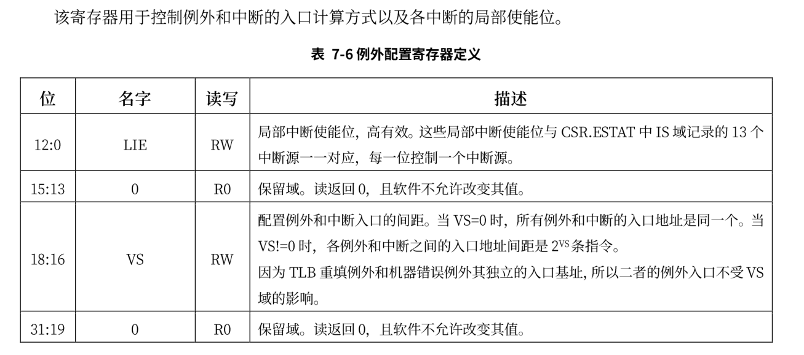

# 特权级架构

龙芯架构定义了 4 个运行特权等级（Privilege LeVel，简称 PLV），分别是 PLV0~PLV3。应用软件应运
行在 PLV1~PLV3 这三个非特权的等级上，从而与运行在 PLV0 级上的操作系统等系统软件隔离开。应用软件具体运行在哪个特权等级上是由系统软件在运行时决定的，应用软件对此无法确切感知。龙芯架构下，应用软件通常运行在 PLV3 级上。与risc-v不同，loongarch架构下没有所谓的M态。

刚开机时，CPU 初始化为操作系统核心态对应的运行模式，执行引导程序加载操作系统。操作系统做完一系列初始化后，控制 CPU 切换到操作系统用户态对应的运行模式去执行应用程序。应用程序执行过程中，如果出现用户态对应的运行模式无法处理的事件，则 CPU 会通过异常或中断回到核心态对应的运行模式，执行操作系统提供的服务程序。操作系统完成处理后再控制 CPU 返回用户态对应的运行模式，继续运行原来的应用程序或者调度另一个应用程序。在 LoongArch 指令系统中，CPU 当前所处的运行模式由当前模式信息控制状态寄存器（CSR.CRMD）的 PLV 域的值确定，其值为 0～3 分别表示 CPU 正处于 PLV0～PLV3 四种运行模式。


当前我们只需要关注其低两位，与特权级相关的还有CSR.PRMD的寄存器


在后面会介绍如何使用这两个寄存器完成特权级切换。


## 特权指令

所 有 特 权 指 令 仅 在 PLV0 特 权 等 级 下 才 能 访 问 。 仅 有 一 个 例 外 情 况 ， 当 CSR.MISC 中 的
RPCNTL1/RPCNTL2/RPCNTL3 配置为 1 时，可以在 PLV1/PLV2/PLV3 特权等级下执行 CSRRD 指令读取性能计数器。在本实验中并不涉及到性能计数器，因此可以不用关注。

在实验中，现阶段常用到的特权指令有:

```assembly
csrrd rd, csr_num
csrwr rd, csr_num
ertn
idle
```

CSRRD 指令将指定 CSR 的值写入到通用寄存器 rd 中。CSRWR 指令将通用寄存器 rd 中的旧值写入到指定 CSR 中，同时将指定 CSR 的旧值更新到通用寄存器 rd 中。所有 CSR 寄存器的位宽要么是 32 位，要么与架构中的 GR 等宽，因此 CSR 访问指令不区分位宽。在 LA32架构下，所有 CSR 自然都是 32 位宽。在 LA64 架构下，定义中宽度固定为 32 位的 CSR 总是符号扩展后写入到通用寄存器 rd 中的。当 CSR 访问指令访问一个架构中未定义或硬件未实现的 CSR 时，读动作可返回任意值（推荐返回全 0值），写动作不修改处理器的任何软件可见状态。

ertn 指令用于trap上下文切换的处理返回。执行 IDLE 指令后，处理器核将停止取指进入等待状态，直至其被中断唤醒或被复位。从停止状态被中断唤醒后，处理器核执行的第一条指令是 IDLE 之后的那一条指令。

在后续实验中，会使用与TLB和IO相关的特权指令，这些后续会进行介绍。


## 例外

异常与中断是一种打断正常的软件执行流，切换到专门的处理函数的机制。它在各种运行模式的转换中起到关键的纽带作用。比如用户态代码执行过程中，当出现对特权空间的访问，或者访问了虚实地址映射表未定义的地址，或者需要调用操作系统服务等情况时，CPU 通过发出异常来切换到核心态，进入操作系统定义的服务函数。操作系统完成处理后，返回发生异常的代码并同时切换到用户态。通常会将中断也视为一种特殊的异常，不过中断是异步的而普通异常是同步发生的，从来源看，异常可以有以下几种:

- 外部事件：来自 CPU 核外部的事件，通常是中断
- 指令执行中的错误：执行中的指令的操作码或操作数不符合要求，例如不存在的指令、除法除以 0、地址不对齐、用户态下调用核心态专有指令或非法地址空间访问等
- 数据完整性问题：当使用 ECC 等硬件校验方式的存储器发生校验错误时，会产生异常。这个功能可以被关闭。一般不会涉及到这个处理
- 地址转换异常：在存储管理单元需要对一个内存页进行地址转换，而硬件转换表中没有有效的转换对应项可用时，会产生地址转换异常。这部分会在开启页表后进行介绍。
- 系统调用和陷入：由专有指令产生，其目的是产生操作系统可识别的异常，用于在保护模式下调用核心态的相关操作。这个是本节关注的重点。
- 浮点运算错误

loongarch平台上主要的异常如下所示:


## 中断

LoongArch 指令系统支持中断线的中断传递机制，共定义了 13 个中断，分别是：1 个核间中断（IPI），1个定时器中断（TI），1个性能监测计数溢出中断（PMI），8个外部硬中断（HWI0~HWI7），2个软 中断（SWI0~SWI1）。其中所有中断线上的中断信号都采用电平中断，且都是高电平有效。当有中断发生时，这种高电平有效中断方式输入给处理器的中断线上将维持高电平状态直至中断被处理器响应处理。无论中断源来自处理器核外部还是内部，是硬件还是软件置位，这些中断信号都被不间断地采样并记录到 CSR.ESTAT 中 IS 域的对应比特位上。这些中断均为可屏蔽中断，除了 CSR.CRMD中的全局中断使能位 IE 外，每个中断各自还有其局部中断使能控制位，在 CSR.ECFG 的 LIE 域中。当CSR.ESTAT 中 IS 域的某位为 1 且对应的局部中断使能和全局中断使能均有效时，处理器就将响应该中断，并进入中断处理程序入口处开始执行。

在支持多个中断源输入的指令系统中，需要规范在多个中断同时触发的情况下，处理器是否区别不同来源的中断的优先级。当采用非向量中断模式的时候，处理器通常不区别中断优先级，此时若需要对中断进行优先级处理，可以通过软件方式予以实现，其通常的实现方案是：

1. 软件随时维护一个中断优先级（IPL），每个中断源都被赋予特定的优先级。
2. 正常状态下，CPU 运行在最低优先级，此时任何中断都可触发。
3. 当处于最高中断优先级时，任何中断都被禁止。
4. 更高优先级的中断发生时，可以抢占低优先级的中断处理过程。

当采用向量中断模式的时候，处理器通常不可避免地需要依照一套既定的优先级规则来从多个已生效的中断源中选择一个，跳转到其对应的处理程序入口处。LoongArch 指令系统实现的是向量中断，采用固定优先级仲裁机制，具体规则是硬件中断号越大优先级越高，即 IPI 的优先级最高，TI 次之，⋯，SWI0 的优先级最低。


## 部分控制状态寄存器

处理上述提到的PRMD和CRMD两个寄存器外，实验中还会涉及到其它很多寄存器，下面只会显示本节可能会使用到的寄存器

### ECFG



### ESTAT


### ERA


