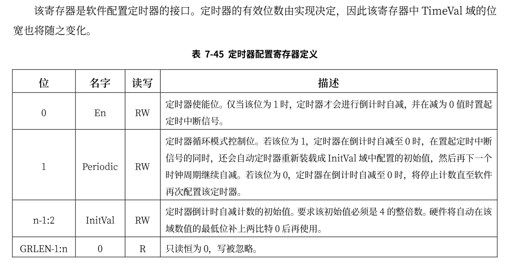
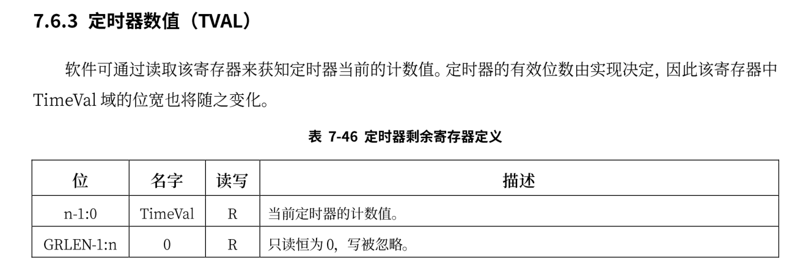

# 时钟

在多道程序和协作式调度的基础上，应用程序可以各自获得处理器的使用权了，但这仍然需要应用程序的编写者主动地去让出处理器，如果某个应用程序不主动让出，那么其它的任务将永远不会获得使用权。为了使得操作系统对应用程序的管理更加公平合理，需要完成

- 分时多任务：操作系统管理每个应用程序，以时间片为单位来分时占用处理器运行应用。
- 时间片轮转调度：操作系统在一个程序用完其时间片后，就抢占当前程序并调用下一个程序执行，周而复始，形成对应用程序在任务级别上的时间片轮转调度。


在前文中已经大致介绍了loongarch上的中断，各中断源发来的中断信号被处理器采样至 CSR.ESTAT.IS 域中，这些信息与软件配置在 CSR.ECFG.LIE域中的局部中断使能信息按位与，得到一个 13 位中断向量int_vec。当 CSR.CRMD.IE=1 且 int_vec 不为全0 时，处理器认为有需要响应的中断，于是从执行的指令流中挑选出一条指令，将其标记上一种特殊的例外——中断例外。随后处理器硬件的处理过程与普通例外的处理过程一样了。

loongarch平台上的时钟中断与risc-v的不相同，与时钟中断相关的寄存器如下:

## TCFG



### TVAL



为了打开时钟中断，不仅需要开启全局中断和时钟中断对应的局部使能中断，还需要配置CSR.TCFG中的En位。时钟的中断频率由TCFG.Initval位决定，在risc-v中每次发生时钟中断，都需要配置mtimecmp寄存器的值，在loongarch上，只需要开启TCFG.Periodic位就可以使得在发生时钟中断后不用在手动更新下一次发生中断的时间。

开启时钟中断的代码如下：

```rust
pub fn enable_timer_interrupt() {
    Ticlr::read().clear(); //清除时钟专断
    Tcfg::read()
        .set_enable(true) //开启计时
        .set_loop(true) //开启循环
        .set_tval(0x100000usize) //设置中断间隔时间
        .flush(); //写入计时器的配置
    Ecfg::read().set_local_interrupt(11, true); //开启局部使能中断
    Crmd::read().set_interrupt_enable(true); //开启全局中断
}
```

时钟中断对应的处理代码如下：

```rust
fn timer_handler() {
    let mut ticlr = Ticlr::read();
    ticlr.set_val(ticlr.get_val() | CSR_TICLR_CLR); //清除时钟中断
    suspend_current_run_next();
}
```


龙芯指令系统定义了一个恒定频率计时器，其主体是一个 64 位的计数器，称为 Stable Counter。Stable
Counter 在复位后置为 0，随后每个计数时钟周期自增 1，当计数至全 1 时自动绕回至 0 继续自增。同时每
个计时器都有一个软件可配置的全局唯一编号，称为 Counter ID。恒定频率计时器的特点在于其计时频率
在复位后保持不变，无论处理器核的时钟频率如何变化。获取计时器的实现如下:

```rust
pub struct Time {}

impl Time {
    pub fn read() -> usize {
        let mut counter:usize;
        unsafe {
            asm!(
            "rdtime.d {},{}",
            out(reg)counter,
            out(reg)_,
            );
        }
        counter
    }
}
```

